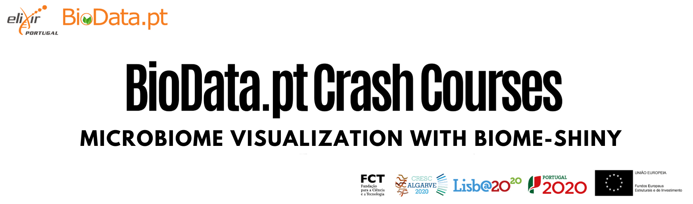

 
 

## Course Description

This crash course serves as a practical introduction to the tools and methods used to create a dataset of microbiome data and visualize environmental diversity. The first part of the course will consist of applying the DADA2 algorithm to a set of paired-end fastq files, split by sample and with the barcodes/adapters removed. 

From this dataset, participants are expected to obtain an **amplicon sequence variant (ASV)** table, which is a higher-resolution equivalent of the traditional OTU table. 

After assigning taxonomy to the output sequences, the dataset will be converted to the **BIOM format**, and, using the Biome-Shiny tool, its composition and diversity will be visualized through a series of interactive plots. By the end of the course, participants should be able to apply the learned methods to their own data.

## Target Audience

Scientists who want to learn the basics of microbiome analysis in Bioinformatics, and have little knowledge of programming.

---

## Course Documentation

The dataset provided for this course is the same as those used in the mothur MiSeq SOP. The data consists of fastq files, which were generated by 2x250 Illumina MiSeq amplicon sequencing of the V4 region of the 16S rRNA gene collected longitudinally from a mouse post-weaning.

**Note** - The dataset used for this crash course is available by clicking the link below. You need to unzip this file and follow the instructions throughout the documentation.

[**Download Course Dataset**](http://www.mothur.org/w/images/d/d6/MiSeqSOPData.zip)

 

## Morning Period

### Creating an analysis-ready dataset with the DADA2 pipeline

During the morning period, you will be introduced to next-generation sequencing (NGS) of 16S rRNA gene amplicon processing techniques, that allow you to convert large amounts of raw sequence data into clusters of similar sequences, known as Operational Taxonomic Units (OTUs) that can be annotated against a sequence database. You will apply the DADA2 algorithm to eliminate sequencing errors from reads (denoising) and obtain a table of Amplicon Sequence Variants (ASVs), which have less genetic divergence than OTUs.

[(Link)](pages/dada2/Biodata.ptCrashCourses.html)

## Afternoon Period

### Visualizing microbiome diversity and composition with Biome-Shiny

The afternoon period is a hands-on demonstration of Biome-Shiny, a user-friendly web application to visualize the composition and diversity of microbial communities. Participants will upload the dataset they generated during the morning period and visualize the microbial composition, primary microbial communities and alpha- and beta-diversity of the dataset.

[(Link)](pages/biomeshiny/biomeshiny.html)  
  
---

## Learning Objectives

By the end of this course, participants are expected to be able to apply the bioinformatics pipeline included in the "dada2" library to their own data, to process sets of paired-end sequences into an ASV table, going through the process of filtering and trimming reads, estimating error rates, dereplicating and denoising sequences, creating the ASV table with the merged sequences and assigning taxonomy to the ASVs after removing chimeras. Participants should understand the basics of exploring and analyzing a microbial community, and how it can be done through the Biome-Shiny application.

## Course Pre-requisites

This course has no pre-requisites, although basic knowledge of R scripting is recommended. If you intend to replicate the DADA2 pipeline with your own data, some knowledge of R may be needed.  

## Instructors

+ Henrique Costa (BioData.pt / Instituto Gulbenkian de Ciência)
+ António Sousa (Instituto Gulbenkian de Ciência)

## Organizers

+ BioData.pt
+ IGC Bioinformatics Unit (UBI-IGC)
+ IGC Genomics Unit (UG-IGC)

## About BioData.pt

BioData.pt is the Portuguese distributed e-infrastructure for biological data and the Portuguese ELIXIR node.

It supports the national scientific system through best practices in data management and state of the art data analysis, and interfaces with both academia and industry, making research available for innovation, namely in sectors such as agro-food and forestry, sea, and health.

BioData.pt services include ELIXIR services such as our training programme and computing facilities, as well as consulting services in data analysis and management, and a number of community services.

---

 
 

The source for this course webpage is on [github](https://github.com/igcbioinformatics/biomeshinycourse).

 

 BioData.pt Crash Course: Microbiome Visualization with Biome-Shiny by BioData.pt is licensed under a <a rel="license" href="http://creativecommons.org/licenses/by/4.0/">Creative Commons Attribution 4.0 International License</a>.