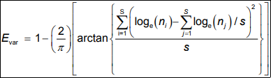
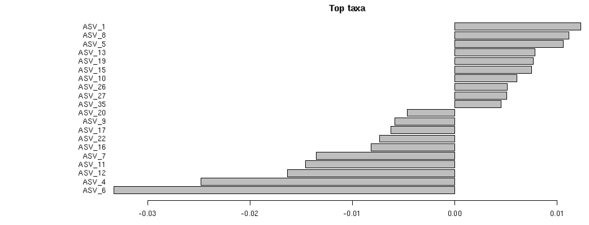

### Introduction

Biome-Shiny is a web application designed to provide an easy-to-use graphical interface for microbiome data visualization, offering a variety of interactive plots in order to visualize a dataset.

The tool was created with the purpose of providing researchers with a tool that simplifies their work in obtaining information about microbiomes, without having to spend time finding the ideal set of libraries to assist with their research, or have to spend potentially a large amount to use these libraries, each with their own functions and workflows. The tool also serves as a way to introduce users to microbiome analysis and visualization by showcasing a set of commonly-produced graphical outputs by well-known microbiome analysis packages like "phyloseq".

The application's name comes from the "shiny" library, which was used to develop the Biome-Shiny's graphical interface, and the "microbiome" library, one of the libraries responsible for the application's data upload, analysis, filtering and graphical output functions.

### Installation

For the purposes of this crash course, Biome-Shiny should come pre-installed on your machine. However, if you'd like to try this course at home, you can install Biome-Shiny by following a few steps.

First, Biome-Shiny has a series of dependencies which it will require you to install outside of R. The following instructions apply to a computer running Ubuntu. Open up a terminal instance and type in the following:

    sudo apt install libfontconfig1-dev libcairo2-dev libcurl4-openssl-dev libssl-dev libxml2-dev

If you already have R updated, it is a best practice to update your currently-installed libraries before installing any new ones.

    update.packages() 

After that, install the devtools library, if it isn't already installed. Type the following into the R console:

    install.packages("devtools")

Once all prerequisites are installed, use the devtools library to install Biome-Shiny from GitHub.

    library("devtools")
    install_github("https://github.com/BioData-PT/Biome-Shiny")

Any other Biome-Shiny dependencies will be installed automatically. Once the installer is done, we can launch the application!

### Launching the application

All you need to do to launch the application is to open the R console and type in the following:

      biomeshiny.package::launchApp()

Then, in your browser of choice, type the following in the address bar:

    localhost:4800

### (1) Inputs and Outputs

During the morning period, you generated a type of file called a BIOM file. In addition to that file, you also obtained a .csv file containing metadata for the ASVs in the dataset.

Biome-Shiny accepts, as an input, a single .biom file, which may or may not be accompanied by a .csv file containing the dataset's metadata sample variables. These files can be generated by various metagenomics pipelines, such as QIIME and Mothur, or by converting the output of a pipeline (ASV and OTU tables, taxonomic annotations and metadata files) through the Biom-Format Python application.

The .biom file should contain an OTU table or an equivalent table, and the taxonomic annotations for the table's species. In this case, it'll contain the ASV table you generated during the morning period, along with the ASV's taxonomic annotations. 

The metadata included in the .csv file provides context for the ASVs and the dataset's samples, allowing us to examine, for example, the distribution of species between samples with different conditions, or compare groups of samples to check for major differences.

### (2) Uploading Data

When you start up Biome-Shiny, you'll be met with a menu, which allows you to upload your data. The menu will initially present you with two options.

*Biome-Shiny's data upload menu*

+ "Upload dataset" will allow you to upload your own data, a BIOM file containing an OTU or ASV table and respective its taxonomic annotation.
+ "Use sample dataset" allows you to choose one of the two sample datasets included with the application.

For this crash course, we'll be using the newly-created BIOM file as our input. To upload the BIOM file:

+ Tick "Upload dataset".
+ Tick ".biom file with .csv metadata file"
+ Click "Browse" on the search bar labeled "Dataset". Find the BIOM file you created and select it. Its name should be "asvTable.biom"
+ Click "Browse" on the search bar labeled ".csv metadata file (sample variables)" and upload the metadata .csv file, which has the default name "metadata.csv".
+ In "Taxonomy parsing function", select "Greengenes".
+ Click "Update Dataset". This will merge the metadata file's contents with the .biom file, and set the data you uploaded as the working dataset.
+ Check the  tab and wait. If you did everything right, you  should see two blocks of text, displaying information about the dataset. We'll return to this table later.

*An image of the summary*

### (3) Data Filtering

A set of data might contain information that might not be useful, such as species which only appear a single time in the dataset, which may be the result of errors during sequencing. Data filtering functions can be useful to improve the quality of a dataset by removing errors, but can also be used to trim a dataset to remove unwanted samples or ignore certain species that are irrelevant to the experiment.

Click  on the dashboard sidebar to open the dataset filtering menu. You'll be provided with a variety of methods to subset and filter your data. The filtering options will only be applied to the dataset after ticking the "Set as active dataset" box.

Start by ticking the "Set as active dataset" box. We haven't made any changes yet, so nothing will change in the dataset. If you untick the box, the dataset will return to its default state.

#### (3.1) Top taxa filtering

Sometimes, the user only wants to view the most important species of a dataset. This function will filter data by removing all species except for the top most abundant species, where the number of top species is defined by the user. The default number is 10, meaning that by default, this function will remove all but the top 10 most abundant species. The user can change this value in the "Number of top taxa" prompt. To apply this filter to the dataset, ensure that "Remove non-top taxa" is ticked.

Exercise: **Change the default number of top OTUs to 20. This way, you'll filter out all but the 20 most abundant species. Apply this change to the dataset.**

*Answer*

In order to alter the default number of top OTUs, you have to alter the "Number of top taxa" number from the default 10 to 20, then click the "Remove non-top taxa" checkbox. The filtering menu should look like this once you're done:

#### (3.2) Remove unwanted taxa

Sometimes, a species might not be relevant to the experiment at hand, or might be unwanted by the user for a given reason. The "Subset taxa" function allows the user to remove individual species or every element of a species belonging to a taxonomic rank.

Click the "Subset taxa" tab. You will see a checkbox list of taxa, along with a "Taxa rank" dropdown menu. By unticking the taxa you wish to remove and ticking "Subset taxa by taxonomy rank", the user can remove all elements belonging to a certain taxa (i.e. by unticking Bacteroides, the user can remove all ASVs in the Bacteroides genus). The dropdown menu allows the user to change the taxonomic rank for subsetting. This allows the user to have a greater level of specificity when removing species from the dataset.
 
The "Check all taxa" and "Uncheck all taxa" buttons are self-explanatory. Note that unticking all taxa will inevitably lead to errors, as it removes *every* species from the dataset. Use it to filter very large sets of taxa by removing all taxa, then ticking the ones that you want.

*Example*

The picture below shows a dataset's species being filtered out by Phylum. The Proteobacteria, Cyanobacteria and Spirochaetes phyla have been removed from the dataset.

#### (3.3) Removing samples from the dataset

It's also possible to filter out individual samples from the dataset. Click the "Remove samples" tab.

You'll be presented with a checklist of all the samples in the dataset. Untick whichever samples you'd like to remove, and click "Remove unchecked samples" in the dataset.

The "Check all samples" and "Uncheck all samples" buttons, once again, are self-explanatory.

Exercise: **This dataset has 19 samples. Remove samples F3D6, F3D9 and two other samples, so it's left with 15 samples.**

*Answer*

An example on how your menu should look like. Unticked samples will be removed from the dataset.

### (4) Phyloseq Summary

The "Phyloseq Summary (3/3)" tab displays some basic information about the active dataset:

+ Compositional: Are the dataset's abundance values in absolute or relative form?

**Abundance**

**Species abundance** is a measure of environmental diversity, which can be measured in two ways:

+ **Absolute abundance** is the number of elements of a species in a group or sample.
+ **Relative abundance** is the ratio of elements of a species compared to the total number of species in a sample.

+ Min. number of reads: The smallest read.
+ Max. number of reads: The largest read.
+ Total number of reads: A sum of all the reads in the dataset.
+ Average number of reads: Average number of reads per sample.
+ Median number of reads: The median number of reads in the dataset.
+ Sparsity: The ratio of species per sample whose abundance is 0. If every species in every sample has an abundance value above 0, then sparsity is 0.

**Sparsity**

A **sparse matrix** is a matrix in which most elements are zero. Its opposite is a **dense matrix**, where most of the matrix's elements are different from zero. A matrix's **sparsity** is calculated by the number of zero-valued elements in the matrix, divided by the number of total elements.

+ Any OTU sum to 1 or less: Whether there are singletons in the dataset.
+ Number of singletons: A count of all the singletons in the dataset.
+ Percent of OTUs that are singletons: Percentage of OTUs (species) in the dataset which are singletons.

**Singletons**

A **singleton** is a read with a sequence that is present exactly once. That is to say, a unique read. Singletons may be, but are not always, the result of errors during sequencing.

+ Number of sample variables: Counts the number of metadata variables
+ Sample variables : A list of metadata variables, used to characterize and describe the samples and OTUs.

### (5) Core Microbiota Heatmap

The core microbiota heatmap compares differences in species abundance between samples. This allows the user to evaluate if the differences in abundances may be related to the conditions of the samples (for example, if a sample extracted early in the experiment has significantly different abundance values than a sample extracted later on).

Below is an example heatmap, comparing ASV abundance between samples.

**Example heatmap**

*Core microbiota heatmap*

This plot provides a good opportunity to demonstrate Biome-Shiny's plot interactivity. Most plots in Biome-Shiny are interactive, meaning that they can be hovered over for more exact information, as well as be zoomed in and out of to analyze specific parts of the plot.

Question: **When you hover over a colored part, you will notice information labeled as "row", "column" and "value". What do each of these represent?**

*Answer*

"row" and "column" represent a species and a sample, respectively. "value" is the absolute abundance, or the number of elements, of the species in that sample.

Exercise: **Return to the filtering menu. Change the top 20 OTUs back to top 10 and click on "Core microbiota" again. What changed in the plot?**

*Answer*

The number of species shown in the plot decreased from 20 to 10.

The point of this exercise was to demonstrate Biome-Shiny's capability to regenerate plots and tables on the fly, reacting to changes in the active dataset.

Return to the filtering menu again, and untick "Set as active dataset" before you proceed.

### (6) Community Composition Plots

The plots generated in the "Community Composition" tab show the absolute and relative abundance values of species, highlighted by a user-defined taxonomic rank.

To generate these plots, the user is required to set up a series of variables.

The Variables tab, as the name implies, contains the menu where the user sets the variables that generate the barplots. A quick rundown on these variables:

+ The "Sample variable:" dropdown menu sets the metadata variable whose abundance will be analyzed. The user should choose the variable corresponding to the list of samples, although it's possible to choose any metadata variable in the dataset. 
+ "Taxonomy rank:" defines the color highlighting of the plot bars, i.e. choosing Genus will color the bars based on the species' genus.
+ "Transparent background" makes the plot background transparent.
+ "Group samples by metadata variable" will be elaborated on in 6.2. 

*The Variables menu*

#### (6.1) Interpreting the plots

The community composition plots generated by Biome-Shiny are a set of colored barplots, where each color represents a taxon of the chosen taxonomic rank.

*Example of an absolute abundance plot*

The X axis of the plot represents the metadata variable in analysis, which will usually be the samples, while the Y axis represents the taxa's abundance values.
The absolute abundance plot, shown above, measures the number of each taxa in a sample.

*Example of a relative abundance plot*

The relative abundance plot, too, measures how percentages rather than absolute values, but is otherwise identical in interpretation. For example, a sample with a taxon which has relative abundance values between 25% and 75% will have a relative abundance of 50%, or 0.5, in that sample.

If you'd like to inspect a taxon's abundance in more detail, you can double click the taxon's color on the legend in order to isolate it.

Exercise: **Knowing what each variable does, generate your own community composition barplots. Choose the variable corresponding to the samples and Family as the taxonomy rank.**

*Answer*

Using "X" as the sample variable, you will obtain the following plots.

*Absolute abundance plot*

*Relative abundance plot*

Question: **From the plots you generated, what conclusion can you make regarding abundance within the samples' microbial communities? Which taxa are the most abundant in the samples?**

*Answer*

By simple observation of the plots, it becomes clear that Muribaculaceae is the most abundant taxa in all of the samples.

#### (6.2) Grouping samples

Returning to the Variables menu, there's a tickbox labeled "Group samples by metadata variable". Clicking it will expand the menu with another "Metadata:" dropdown list. When you generate a new plot, the samples will be sorted out by the chosen metadata variable.

Exercise: **Using the "Group samples by metadata variable" option, sort samples by the "Condition" variable and generate the new plots.**

**Click to see what the plots will look like**

*Absolute abundance plot*

*Relative abundance plot*

Question: **Are there any new conclusions about differences in community composition that can be drawn from sorting samples by metadata?**

*Answer*

Although Muribaculaceae remains the most abundant Genus in both types of samples, the "Early" samples tend to have a relatively higher content of non-Muribaculaceae genus than than the "Late" samples, as evidenced by the relatively higher amounts of Bacteroidaceae and Rikenellaceae. In addition, the unidentified samples are entirely absent from the "Late" samples.

### (7) Alpha Diversity

Alpha diversity is the diversity that can be found within a sample. Alpha diversity can be measured with many diversity indexes, which are mathematical measures of species diversity in a given community. For example, Richness is a count of the number of unique species in the community. Biome-Shiny presents a few tables with Alpha diversity measures, and provides a visual representation of diversity through a richness plot.

**Richness**

In ecology, **richness** is the number of unique species in a community. It can be used alone as a measure of alpha diversity (by measuring the number of different species in a sample) or beta diversity (by measuring the unique species between samples), or used alongside species evenness to calculate another diversity index, like Simpson or Shannon's diversity.

In this example, each shape inside Sample A represents a different species.
If one measures diversity by sample richness, the alpha diversity in the sample is 3.

#### (7.1) Evenness Table

Evenness is a measure of how close the quantity of each species is present in a sample. For example, in a sample with five species and ten organisms, if each species has two organisms, one can say that the sample's microbial community is even.

*A graphical representation of evenness.*

In the top example, relative abundance is comparatively similar between species, whereas in the bottom example there are significant differences in species' relative abundances. One can say that the top example is an even community, whereas the bottom example is an uneven community*

Pielou's evenness, for example, is a measure whose values range from 0 to 1, with 0 representing a perfectly uneven community, and 1 representing a perfectly even community.

Biome-Shiny creates an evenness table, which presents a series of evenness indexes for each sample in the active dataset.

**Evenness table**

##### (7.1.1) A few evenness indexes

Below are several formulas to measure a community's evenness. All of these measures assume values between 0 and 1, where 1 represents perfectly even abundance between species in the community, and 0 represents an entirely uneven community.

**Camargo's evenness** (Camargo, 1993)

*E'* = Camargo's index of evenness

*Pi* = Proportion of species *i* in the sample

*Pj* = Proportion of species *j* in the sample

*S* = Total number of species in sample

**Simpson's evenness**

*E1/D* = Simpson's measure of evenness

*S* = Number of species in the sample

*D* = Simpson's index

 

**Pielou's evenness** (Pielou, 1966)

*J* = Pielou's evenness index

*H'* = Shannon's diversity index

*S* = Number of species in a sample

**Smith and Wilson's Evar index** (Smith & Wilson, 1996)

*Evar* = Simpson and Wilson's index of evenness

*ni* = Number of individuals of species *i* in sample

*nj* = Number of individuals of species *j* in sample

#### (7.2) Abundance Tables

Both the core microbiota heatmap and the community composition barplots have been used to visualize abundance in the dataset. These abundance tables offer this information in a tabular format, displaying each OTU's abundance per sample, as either a simple count or a ratio.

**Absolute abundance table**

**Relative abundance table**

**Search function**

Tables in Biome-Shiny have a search function, which can be used to narrow down the table and filter out results.

Try searching for a single ASV, by typing its name on the search bar. For example, typing "ASV5", without quotes, in the search bar.

#### (7.3) Richness Table

This table returns a number of alpha diversity estimates. Despite its name, it doesn't only measure richness, as several other measures of diversity. Ideally, it should be used on an **untrimmed** dataset, to provide meaningful results, as many of these measures depend on the presence of singletons to provide accurate results.  

#### 7.3.1. Alpha diversity measures

Below are the some of the formulas for the diversity measures displayed by the richness table.

**Observed species**, as the name implies, is a measure of richness that simply counts the number of species found in a sample.

**Chao1** (Chao, 1984)

Chao1 is an abundance-based estimator that attempts to determine calculate the true number of species in a sample. The formula for the calculation is as follows.

Where Sobs is the number of observed species, F1 is the number of singletons and F2 is the number of doubletons (species which only appear twice in the entire dataset). ACE (short for Abundance-based Covered Estimator) is another measure to estimate undetected species, albeit with a different formula.

**Simpson's diversity index**

Simpson's Diversity Index is a measure of diversity which takes into account the number of species present in the sample, as well as the species' relative abundance, meaning it increases with richness and evenness. Its formula is the following:

In which *n* represents the number of organisms of a single species, and *N* represents the total of organisms of all species in the sample.

The value of *D* ranges from 0 to 1, in which 0 represents no diversity and 1 represents infinite diversity.

  

**Shannon's diversity index**

Shannon's diversity index, much like Simpson's index, takes abundance of the species into account when calculating diversity. The formula is the following:

In which *S* is the total number of species (richness) in the community and *pi* is the proportion of *S* made up of species *i*.

#### (7.4) Metadata Table

Metadata, or sample variables, provides context for the samples in study, detailing varius conditions and statuses that describe the samples, which may affect the sample microbial composition. 

#### (7.5) Richness Plot

This plot measures richness in samples, by a user-defined index.

Much like the community composition plot, the "Variables" box defines the X and Y axis of the plot, and allows the user to separate samples based on a dataset. 

Exercise: **Using an unfiltered dataset (untick "Set as active dataset" in the Filtering tab), generate a richness plot with Simpson's diversity index as the chosen measure. Be sure to separate the samples by the proper sample variable.**

**Click to see the plot**

Using "Condition" to separate samples and SampleID for point color, you get this plot.

Question: **Which sample has the highest diversity value?**

### (8) Beta Diversity

Beta diversity is the diversity that exists between samples.

Biome-Shiny measures beta diversity through ordination plots. Each point on the ordination plot represents a sample, with the primary objective being to determine similarities and differences in composition between these samples, which are represented by the distances between points.

Biome-Shiny can generate an ordination plot for samples and for taxa. Let's start with the samples plot, on the "Ordination Plot" tab.

**Ordination**

**Ordination**, also known as **gradient analysis**, is a collective term for techniques that order objects characterized by values on multiple variables (multivariate techniques), so that similar objects are represented close to eachother and dissimilar objects are farther away, thus allowing us to establish patterns between objects.

In ecological terms, ordination summarizes community data (such as species abundance data) by producing a low-dimensional ordination space in which similar species and samples are plotted close together, whereas dissimilar species are placed farther apart.

Typically, ordination techniques will be used to describe relationships between species composition and the community's underlying environmental variables. Ordination allows us to determine the relative importance of different variables, with an easy-to-interpret graphical result. 

To demonstrate, we will generate an ordination plot.

Exercise: **Generating an ordination plot**

To generate the plot, we will need to define an ordination method. Some methods will require a dissimilarity index (default "bray"). Finally, it'll be necessary to define a sample variable to color the points. 

+ The "Metadata:" dropdown list changes the points' highlight color based on a sample variable.
+ "Ordination method:" The method used to generate the ordination plot. Default is NMDS (non-metric dimensional scaling).
+ "Distance:" sets a dissimilarity index to calculate a distance matrix. This isn't  necessary for all ordination methods. Default is "bray", the Bray-Curtis dissimilarity index. Note that the Unifrac distance requires a phylogenetic tree to work, which this dataset doesn't have, and thus will give an error.

Before generating the plot, return to the "Filtering" tab and undo all changes to your dataset. To do this, simply untick "Set as active dataset".

Once you're done, generate the plot, setting the plot variables to your liking, then clicking the "Plot" tab.

Question: **Which metadata variable is best for highlighting the samples?**

The "Condition" variable, as there's a clear separation between early and late samples.

Question: **What conclusions can you derive from analyzing the plot?**

It can be asserted that the differences in environmental conditions between early and late samples might play an important part in influencing the samples' microbial community composition.  

### (9) PERMANOVA test

The PERMANOVA test (short for "permutational analysis of variances") is a non-parametric multivariate statistical test. It's used to compare groups of objects and test the null hypothesis that the centroids and dispersion of the groups as defined by measure space are equivalent for all groups.

The null hypothesis that PERMANOVA tests is as follows: "the centroids of the groups, as defined in the space of the chosen resemblance measure, are equivalent for all groups." If the hypothesis were true, then any observed differences among the centroids in a given set of data will be similar in size to what would be obtained under random allocation of individual sample units to the groups.

An example of a correct null hypothesis would be: "There are no differences in the composition and/or relative abundances of organisms of different species in samples from different groups."

In simple terms, the PERMANOVA test attempts to determine whether or not a given variable is significant for dividing samples into distinct groups. If the variable is insignificant, the null hypothesis is incorrect, and if it is significant, then the null hypothesis is correct.

Biome-Shiny calculates PERMANOVA using the adonis() function from the "vegan" library. It performs an analysis of variance test using distance matrices, and attempts to find if the metadata variable grouping the samples is significant for the difference in composition between samples.

#### (9.1) AOV table (PERMANOVA test output)

The output of the test is an AOV table which shows sources of variation, degrees of freedom, sequential sums of squares, mean squares, F statistics and R-squared and p-values. If the p-value has a value lower than the statistical significance value (usually 95%, meaning the p-value should be under 0.05) then the studied variable is considered significant - in practical terms, the variable used to group the samples has a significant effect on the composition of the samples.

In order to ensure that the results are relevant, it's also necessary to carry out a homogeniety of dispersion test, which is performed alongside PERMANOVA. Should the P-value obtained from the homogeniety test have a value higher than that of the statistical significance value, then one can assume that the results from the PERMANOVA test are only locally relevant (relevant to parts of the dataset), rather than relevant to all of the data.

Question: **Considering the results obtained from the ordination plot, run a PERMANOVA test with a variable that is likely related to differences between the samples' composition. Use the Bray-Curtis distance, 1000 permutations and consider a significance of 95%. Is the result statistically significant? What about for a significance of 99%?**

*Answer*

The Beta diversity ordination plot showed that the "Condition" variable, when used as a point color, clearly divided the samples in two distinct groups. Therefore, we should use "Condition" as the sample variable.

*The variables used to perform PERMANOVA*

Click "Data Tables" for the results of the test.

With a p-value of 0.0009, the time when the sample was extracted seems to be statistically significant for a significance of 95% (p < 0.05) and 99% (p < 0.01). Let's confirm if the results are relevant by checking the homogeniety table's p-value.

The p-value is 0.0059. 0.0059 < 0.05 and 0.0059 < 0.01, therefore, the "Condition" variable is statistically significant with a significance of 95% and 99%.

#### (9.2) Top Factors plot

The top factors plot allows a user to view the top 20 species responsible for the difference in community composition between groups of samples.

**Example**

In this case, ASV_1 and ASV_6 are the most important species for distinguishing the Early and Late sample groups.

The plot is essentially a visualization of the PERMANOVA test, which compares the difference between the relative abundances of species in groups of samples.

### (10) Sample Network Plot

A network plot is used to show interconnections between a set of entities. In this case, it connects ecological distances between samples, based on a variable. It's similar in nature to the ordination plot, albeit it functions differently.

"Distance method:" will allow you to choose the method to calculate the distance matrix. Default is "bray".

"Sample variable to cluster data samples:" is the metadata variable based on which the samples will be grouped.

"Sample variable to set different point shapes:" will change the points' shapes based on that metadata variable. Note that the maximum amount of shapes is 6.

Exercise: **Experimenting with the network plot!**

A network plot is an easy way to establish relations between large amounts of samples. Let's demonstrate that.

First, set "Sample variable to cluster data samples:" to a variable that you know produces a clear distinction between samples.

Exercise: **Set "Sample variable to set different point shapes:" to "Condition". What does your plot look like? Can you find any relations?**

*Answer*

The network plot will show three relations - between the "Late" samples, between samples F3D8 and F3D9 and between samples F3D6 and F3D7.

It's important to choose the right sample variable when grouping your samples, in order to obtain useful relations.

Question: **To demonstrate the importance of choosing the right sample variable to group your samples, try switching "When" with "Samples". What happens?**

*Answer*

As you can see, the result produces a poor result, with no interconnections between samples. This is because of the metadata variable used to group the samples, which are the samples themselves.

Let's try redoing this plot with a larger dataset.

+ Return to the Data Upload menu, and click "Use sample dataset."

+ Select the "dietswap" option in the dropdown menu, and press "Update Dataset."

+ Confirm that the dataset updated by clicking on "Phyloseq Summary"

**Context of the "dietswap" dataset**

The dataset is based on "Fat, fibre and cancer risk in African Americans and rural Africans", which was a study that consisted on a two-week dietary exchange between rural South Africans, with a traditionally high-fibre, low-fat diet. and African Americans, who practiced a high-fat, low-fibre western diet, to investigate their diets' effect on microbiome composition and colon cancer rates.

Once you've confirmed the dataset is loaded (check for changes in the Phyloseq Summary), return to the Network Plot menu.

Question: **Using "nationality" as the variable to cluster samples around, generate a network plot. Can you find any major sample clusters?**

*Answer*

There are several clusters of samples in the plot, most noticeably a large cluster of AFR samples, which seems to connect most samples of the group. It also appears to have some overlap with a group of AAM samples. This suggests that despite belonging to distinct groups, there are sets of AAM samples that are of a similar composition to AFR samples. 

In addition, there are several other clusters of AAM samples, as well as a few, noticeably smaller AFR sample clusters. By examining this plot, one can make the assertion that AFR samples are likely more similar in composition to eachother than AAM samples.

### (11) Saving results

Having generated your desired tables and plots, you will now want to save your results for later use. Biome-Shiny allows the user to save plots and tables with ease. Tables will be saved in a .csv file format, which will allow the user to access them in Microsoft Excel and similar programs.

Interactive plots can be saved by clicking the "Download plot as a png" button (it looks like a camera) at the top right of each plot. As for tables, you can save them by clicking the Download button below each plot. 

Exercise: **Test out these functionalities by saving a table and a plot of your choosing, and opening them.**

You can also download an HTML report. The report contains the generated plots, as well as the first lines of each generated table.

### (12) Closing remarks

Biome-Shiny is a tool designed to introduce people to Bioinformatics. It's designed with beginners in mind, and people with little experience with R scripting, to provide them with a set of analyses that are frequently used when exploring a microbial community dataset. By the end of this crash course, you should be able to use the tool to explore your own data.

Biome-Shiny is an open-source tool, which can be found at https://github.com/BioData-PT/Biome-Shiny

### References

+ Winston Chang, Joe Cheng, JJ Allaire, Yihui Xie and Jonathan McPherson (2019). shiny: Web Application Framework for R. R package version 1.4.0. https://CRAN.R-project.org/package=shiny

+ Winston Chang and Barbara Borges Ribeiro (2018). shinydashboard: Create Dashboards with 'Shiny'. R package version 0.7.1. https://CRAN.R-project.org/package=shinydashboard

+ Eric Bailey (2015). shinyBS: Twitter Bootstrap Components for Shiny. R package version 0.61. https://CRAN.R-project.org/package=shinyBS

+ Paul J. McMurdie and Joseph N Paulson (2019). biomformat: An interface package for the BIOM file format. https://github.com/joey711/biomformat/, http://biom-format.org/.

+ phyloseq: An R package for reproducible interactive analysis and graphics of microbiome census data. Paul J. McMurdie and Susan Holmes (2013) PLoS ONE 8(4):e61217.

+ Leo Lahti et al. microbiome R package. URL: http://microbiome.github.io

+ JJ Allaire and Yihui Xie and Jonathan McPherson and Javier Luraschi and Kevin Ushey and Aron Atkins and Hadley Wickham and Joe Cheng and Winston Chang and Richard Iannone (2019). rmarkdown: Dynamic Documents for R. R package version 1.18. URL https://rmarkdown.rstudio.com.

+ Yihui Xie, Joe Cheng and Xianying Tan (2019). DT: A Wrapper of the JavaScript Library 'DataTables'. R package version 0.10. https://CRAN.R-project.org/package=DT

+ H. Wickham. ggplot2: Elegant Graphics for Data Analysis. Springer-Verlag New York, 2016.

+ Alboukadel Kassambara (2019). ggpubr: 'ggplot2' Based Publication Ready Plots. R package version 0.2.4.999. https://rpkgs.datanovia.com/ggpubr/

+ Carson Sievert (2018) plotly for R. https://plotly-r.com

+ Tal Galili, Alan O'Callaghan, Jonathan Sidi, Carson Sievert; heatmaply: an R package for creating interactive cluster heatmaps for online publishing, Bioinformatics, , btx657, https://doi.org/10.1093/bioinformatics/btx657

+ Hadley Wickham (2017). tidyverse: Easily Install and Load the 'Tidyverse'. R package version 1.2.1. https://CRAN.R-project.org/package=tidyverse

+ Bob Rudis (2019). hrbrthemes: Additional Themes, Theme Components and Utilities for 'ggplot2'. R package version 0.6.0. https://CRAN.R-project.org/package=hrbrthemes

+ Hadley Wickham (2007). Reshaping Data with the reshape Package. Journal of Statistical Software, 21(12), 1-20. URL http://www.jstatsoft.org/v21/i12/.

+ Jari Oksanen, F. Guillaume Blanchet, Michael Friendly, Roeland Kindt, Pierre Legendre, Dan McGlinn, Peter R. Minchin, R. B. O'Hara, Gavin L. Simpson, Peter Solymos, M. Henry H. Stevens, Eduard Szoecs and Helene Wagner (2019). vegan: Community Ecology Package. R package version 2.5-6. https://CRAN.R-project.org/package=vegan

+ Erich Neuwirth (2014). RColorBrewer: ColorBrewer Palettes. R package version 1.1-2. https://CRAN.R-project.org/package=RColorBrewer

 

Back to [main page](../index.html).
