<br>


### Introduction
*(20-30 min)*

The next-generation sequencing (NGS) of 16S rRNA gene amplicon generates large amounts of raw sequence data that needs to be processed before being annotated against a reference database. Processing reads into comprehensive biological information consists in decreasing the complexity from these huge sequence datasets until annotation tables using high-performance algorithms integrated in bioinformatics pipelines (Leipzig 2017). Basically what we try to do when we are analysing 16S rRNA gene amplicon NGS data is to reverse the whole proccess: from sequencing --> library prep --> DNA extraction --> original community --> to single bacteria. For the analysis of 16S rRNA gene amplicon NGS data it usually includes the following steps (not necessarily all neither by this order): 

  (1) demultiplexing the raw amplicon libraries into samples based on barcodes/indexes sequences
  (2) filter/trim primers and the reads based on quality (Phred) scores, length, homopolymers, *etc* 
  (3) join/merge paired-end reads (only for paired-end reads - Illumina) 
  (4) align reads for further quality control (optional)
  (5) dereplicating equal/unique sequences (100% identical sequences) 
  (6) detect/remove chimeras - artificial sequences with multi parent origin produced during PCR amplification (optional)
  (7) cluster unique/dereplicated sequences into Operational Taxonomic Units (OTUs) based on user-defined threshold (usually 97-98%) 
  (8) classify/annotate taxonomically OTUs against a non-redundant reference database

Following this pipeline you will end-up with the so called **OTU** table (with annotation) often clustered at 97% similarity threshold. **OTU** stands for *Operational Taxonomic Unit* that represents one cluster of similar sequences (>97%) of one *species* or taxa. Sequences are clustered into OTUs mostly by two reasons: 

  + to mask some intraspecific diversity
  + to mask sequencing errors 

However, to get an approximation of roughly 1 OTU ≈ 1 species, the threshold of 97% proved to be slightly higher - close to 100% for the V4 region of the 16S rRNA gene ([Edgar, 2018](https://duckduckgo.com/?q=Updating+the+97%25+identity+threshold+for+16S+ribosomal+RNA+OTUs&t=osx&ia=web)). Therefore, if we could eliminate sequencing errors, we would not need to cluster sequences into OTUs. 

<br>

<center><figure>
  
  <figcaption>Figure describing the difference between <i>Amplicon Sequence Variants</i> (<b>ASVs</b>) <i>vs</i> <i>Operational Taxonomic Units</i> (<b>OTUs</b>) (figure adapted from (Callahan et al. 2016)).</figcaption>
</figure></center>

<br>

Denoising is the step of removing sequencing noise, *i.e.*, removing sequencing errors from sequencing reads. There are several *denoising* algorithms. This course will focus on the **Divisive Amplicon Denoising Algorithm** (aka **DADA2**) an algorithm for correcting Illumina-sequenced amplicon errors (Rosen et al. 2012; Callahan et al. 2016). **DADA2** removes the sequencing error from reads yielding true biological sequences. Thus it does not cluster sequences into OTUs to mask sequencing errors. These *unique partitions of sequences* are different from OTUs since they vary between them as little as 1 nucleotide. Therefore these *unique partitions of sequences* were designated **Amplicon Sequence Variants** (aka exact sequences or sub-OTUs). We choose **DADA2** for several reasons, one of these was because it allows flexibility to proccess several types of data, such as 454, Ion Torrent and single- as well as paired-end Illumina amplicon NGS data, with different amplicon sizes, *e.g.*, ITS, 18S and 16S rRNA genes, full-length 16S rRNA genes (from PacBio), in all operating systems (ubuntu, Mac OS and Windows). The two main advantages of applying denoising-based instead of OTU-based approaches and of working with ASVs *vs* OTUs are: 

  + they diverge as little as 1 nucleotide and, therefore, they represent single nucleotide variants, *i.e.*, there was an increase in genetic resolution compared with OTU-clustering based approaches 
  + it allows consistent labelling since denoised unique sequences are true biological sequences without sequencing errors, this means that there is no need to cluster sequences into OTUs in order to mask sequencing errors ([Callahan et al., 2017](https://www.nature.com/articles/ismej2017119.pdf))  

**DADA2** is a *denoising* algorithm but also a pipeline *per se* implemented in the [*R programing language*](https://benjjneb.github.io/dada2/index.html) that is able to perform the following bioinformatic steps:

<details><summary>**DADA2 pipeline flowchart**</summary><p>
<center><figure>
  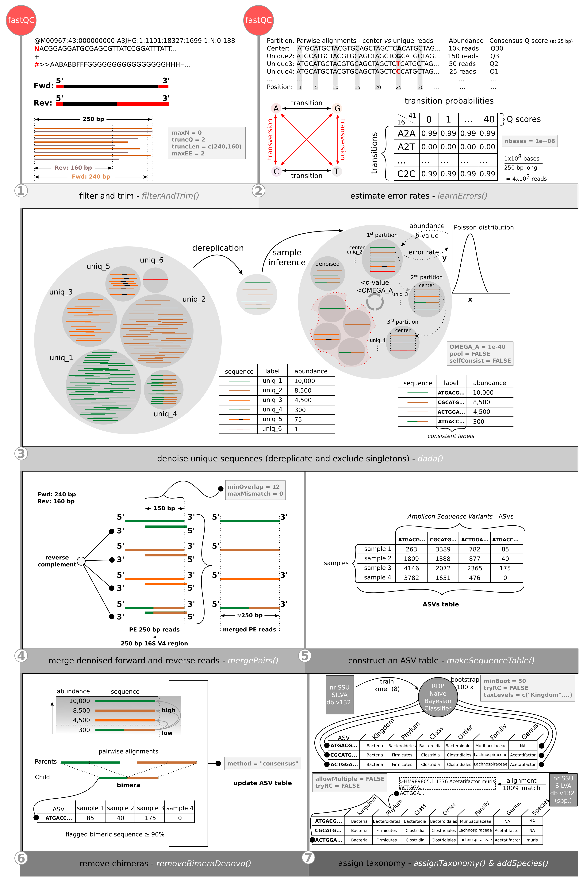
</figure></center>
</p></details> 


   (1) filter and trim reads  
   (2) estimate error rates
   (3) denoise unique sequences (and exclude singletons)
   (4) merge denoised forward and reverse reads 
   (5) construct an ASV table 
   (6) remove chimeras
   (7) assign taxonomy

Despite these differences between <i>denoising-</i> <i>vs</i> <i>clustering-</i>pipelines, the diversity patterns of a specific 16S rRNA gene amplicon NGS study should be broadly similar no matter the kind of pipeline applied (Glassman and Martiny 2018).

<br>


### Before getting started 
*(10-15 min)*

This tutorial is a replication of the [**original DADA2 tutorial**](https://benjjneb.github.io/dada2/tutorial.html) made by [Benjamin Callahan](https://callahanlab.cvm.ncsu.edu/). The [dada2](https://benjjneb.github.io/dada2/index.html) pipeline and R package were developed by Benjamin Callahan and colleagues (Callahan et al. 2016). We will use the same subset of 16S rRNA gene amplicon data from fecal mouse samples published by the [Schloss lab](https://www.ncbi.nlm.nih.gov/pmc/articles/PMC3753973/pdf/zam5112.pdf) (Schloss et al. 2012; Kozich et al. 2013). This dataset was also analyzed with the [mothur MiSeq SOP](https://www.mothur.org/wiki/MiSeq_SOP) that runs an OTU-clustering based pipeline. This subset includes fecal mouse samples collected daily from the next 150 days post-weaning (early - 0-9 days - and late - 141-150 days). So, one of the questions that you can try to answer is: **How did the composition of the mouse gut microbiome change from the early days to the late days after weaning?** 

<br>

<center><figure>
  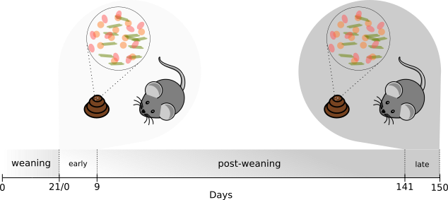
</figure></center>

<br>
<br>

The **16S rRNA gene amplicon - upstream data analysis** course assumes that you will start with paired-end V4 16S rRNA Illumina fastq files: 

   + all the samples came from the same sequencing run (otherwise you need to run each subset from a different sequencing run independently);

   + demultiplexed (most of the sequencing companies deliver fastq files demultiplexed; however, if you need to demultiplex your samples you can download, install and use [sabre](https://github.com/najoshi/sabre));
    
   + without primers/adapters (in the future you may need to remove primers/adapters from your samples, if so, you can download, install and use [cutadapt](https://cutadapt.readthedocs.io/en/stable/) (Martin 2011));
    
   + with the sequences of forward and reverse fastq files matching, *i.e.*, the first sequence of one forward sample should belong to the same *lane*, *tile*, and *cluster (x, y coordinates)* that the first sequence of the respective reverse sample and so on (this could not be the case if you filter your forward and reverse fastq files independently, if so, follow the recommendations made in the **dada2 FAQ** [What if my forward and reverse reads aren’t in matching order?](https://benjjneb.github.io/dada2/faq.html)). <details><summary>see the example</summary><p>
   <center><figure>
      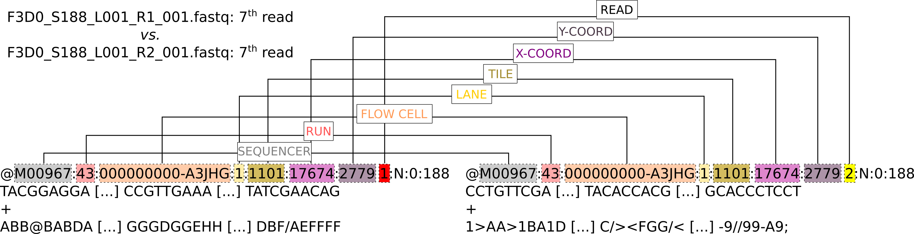
   </figure></center>
   </p></details> 

<br>

#### Requirements: 

><p><font size=2>Warning: all the requirements needed to follow the first part of the course were already satisfied for you for convenience, although you may need to go through these if you are trying to set up this in your own computer</p></font>  

   + Download 16S rRNA gene amplicon NGS data and metadata (Schloss et al. 2012; Kozich et al. 2013):
   
      + [16S rRNA gene amplicon fastq and metadata files](http://www.mothur.org/w/images/d/d6/MiSeqSOPData.zip)
   
   <br>
   
   + Download the Silva reference database (Quast et al. 2012) into a folder named `database`: 
      
      + [silva_nr_v132_train_set.fa.gz](https://zenodo.org/record/1172783/files/silva_nr_v132_train_set.fa.gz?download=1): to assign taxonomy until genus based on naive Bayes classifier
      + [silva_species_assignment_v132.fa.gz](https://zenodo.org/record/1172783/files/silva_species_assignment_v132.fa.gz?download=1): to assign taxonomy until species level based on 100% match
      
   <br>
   
   + Download and install [R version 3.6.2](https://www.r-project.org) and [Rstudio](https://rstudio.com) (R Core Team 2019)
   
   + Download and install [dada2 v.1.14.0](https://benjjneb.github.io/dada2/index.html) R package and dependencies (Callahan et al. 2016)
   
   + Download and install [biom v.2.1.7](http://biom-format.org) command-line python program (Mcdonald et al. 2012)
   
   + Download and install [**Biome-Shiny**: *A Shiny R app for microbiome visualization*](https://github.com/BioData-PT/Biome-Shiny) R shiny app - developed by Henrique Costa from Biodata.pt/IGC 


<br>

#### How to read this document?

>Text: tips and important messages appear indented like this.

<details><summary><b>Concept</b> (click!)</summary><p>
If <b>text</b> appear in bold is a note with auxiliary information that may be useful. Usually it contains bioinformatic terms, exaplanations and information about R code and syntax. 
</p></details>

<br>

<details><summary><i>Answer</i> (click!)</summary><p>
<i>Answers</i> to <i>questions</i> appeared in italic. 
</p></details>

<br>

<details><summary><b>R markdown</b></summary><p>
This document that you open in <b>Rstudio</b> is a <i>R markdown</i> document (with the file extension <i>.Rmd</i>). A <a href ="https://rmarkdown.rstudio.com"><i>markdown</i></a> document is a plain text file with some special syntax that can be easily compiled into a <i>html</i> file. The <i>R markdown</i> is a <i>markdown</i> document with <i>R language</i> embedded. Therefore, <i>R markdown</i> is a very useful resource to write reports since you can combine the text, R programming language and output, <i>e.g.</i>, tables, plots and <i>e.t.c.</i>, into one single document. 
</p></details>
  
<br>
<br>


### Let's start 
*(5-10 min)*

#### Import *dada2* package (and dependencies)

First we will run the **R chunk** code below to import/load *dada2*, its dependencies packages. When you import a package, you are importing/loading all the functions, and perhaps data, if it contains, to your current R session (and memory).

<details><summary><b>R chunk code</b></summary><p> 

It is the special gray text box that allow you to write and run *R code* inside the **R markdown** document. This particular chunk will *install and import packages* required to follow the *upstream data analysis* of 16S rRNA gene amplicon data. 
The default **R chunk** code opened in *Rstudio* has color-symbolic text:

   + <span style="color:green">green</span>: text, aka *strings* in programming (although there is two types of code - (1) *comments* that start with **'#'** and (2) *strings* that incorporate the R code always between quotation marks like this **"string"** )
   
   + <span style="color:blue">blue</span>: special *functions()*, like *library()* to import packages/libraries, logical (`TRUE`/`FALSE`) and numbers
   
   + <span style="color:black">**black**</span>: most of the *functions()*, signs, like **+**, **x**, and parameters (function options that the user uses when calls a function, like below, we passed the *argument* **"dada2"** to the *parameter* **package**)
   
   </p></details>

<br>


```r
### Import package and check the package version

library(package = "dada2") # import package 'dada2'
packageVersion(pkg = "dada2") # prints the 'dada2' version that you have imported - see below after running this function
```

```
## [1] '1.14.0'
```

<br>


<details><summary><b>Set seed</b></summary><p> 

Often you will use functions to perform tasks that requires *randomness*, such as *bootstrapping* in statistics (*i.e.*, random sampling with replacement). Well, we usually re-analyse countless times the same data. Therefore, this will cause slight changes in the output, let's say a number from some calculation,  even if you run exactly the same script. To avoid this we will do what is known as **set seed**. This is, we will keep the *seed* the same no matter how many times we need to run the script. How this  guarantees the reproducibility? Computers can not generate *true* random numbers. They rely on the [**seed**](https://en.wikipedia.org/wiki/Random_seed) to generate a *pseudorandom number*. If you know the *seed*, *i.e.*, if you set the seed, you can predict which will be the *pseudorandom number* generated by the computer.

</p></details>

Run the R chunk code below to set the **seed** to '1024'. 


```r
### Set seed
set.seed(1024) # set seed to the number '1024' - you can use any number
```

<br>


#### Define the directory of 16S rRNA gene amplicon fastq files

<details><summary><b>R's assignment operator</b></summary><p>

Below you can find for the first time in this document the sign **'<-'** that is known as *assignment operator* (equal to **'='**) and as the name suggests it assigns *something* to other *thing*. In the first line of code below it assigns the string *"./MiSeq_SOP"* to the variable *fastqPath*. Therefore the variable or as it is known in R *the object* **fastqPath** contains the string *"./MiSeq_SOP"*.

</p></details>  

<br>

Run the R chunk code below to assign the folder `MiSeq_SOP` to the R object `fastqPath`. 

```r
### set the relative path to the 16S rRNA gene amplicon fastq files directory

fastqPath <- "./MiSeq_SOP" # set the path to the 16S rRNA gene amplicon fastq files that you have download 'MiSeq_SOP' (the './' is a notation used that means 'in the current directory')
list.files(fastqPath) # list all the files under the directory 'fastqPath == ./MiSeq_SOP'
```

```
##  [1] "F3D0_S188_L001_R1_001.fastq"   "F3D0_S188_L001_R2_001.fastq"  
##  [3] "F3D1_S189_L001_R1_001.fastq"   "F3D1_S189_L001_R2_001.fastq"  
##  [5] "F3D141_S207_L001_R1_001.fastq" "F3D141_S207_L001_R2_001.fastq"
##  [7] "F3D142_S208_L001_R1_001.fastq" "F3D142_S208_L001_R2_001.fastq"
##  [9] "F3D143_S209_L001_R1_001.fastq" "F3D143_S209_L001_R2_001.fastq"
## [11] "F3D144_S210_L001_R1_001.fastq" "F3D144_S210_L001_R2_001.fastq"
## [13] "F3D145_S211_L001_R1_001.fastq" "F3D145_S211_L001_R2_001.fastq"
## [15] "F3D146_S212_L001_R1_001.fastq" "F3D146_S212_L001_R2_001.fastq"
## [17] "F3D147_S213_L001_R1_001.fastq" "F3D147_S213_L001_R2_001.fastq"
## [19] "F3D148_S214_L001_R1_001.fastq" "F3D148_S214_L001_R2_001.fastq"
## [21] "F3D149_S215_L001_R1_001.fastq" "F3D149_S215_L001_R2_001.fastq"
## [23] "F3D150_S216_L001_R1_001.fastq" "F3D150_S216_L001_R2_001.fastq"
## [25] "F3D2_S190_L001_R1_001.fastq"   "F3D2_S190_L001_R2_001.fastq"  
## [27] "F3D3_S191_L001_R1_001.fastq"   "F3D3_S191_L001_R2_001.fastq"  
## [29] "F3D5_S193_L001_R1_001.fastq"   "F3D5_S193_L001_R2_001.fastq"  
## [31] "F3D6_S194_L001_R1_001.fastq"   "F3D6_S194_L001_R2_001.fastq"  
## [33] "F3D7_S195_L001_R1_001.fastq"   "F3D7_S195_L001_R2_001.fastq"  
## [35] "F3D8_S196_L001_R1_001.fastq"   "F3D8_S196_L001_R2_001.fastq"  
## [37] "F3D9_S197_L001_R1_001.fastq"   "F3D9_S197_L001_R2_001.fastq"  
## [39] "filtered"                      "HMP_MOCK.v35.fasta"           
## [41] "Mock_S280_L001_R1_001.fastq"   "Mock_S280_L001_R2_001.fastq"  
## [43] "mouse.dpw.metadata"            "mouse.time.design"            
## [45] "stability.batch"               "stability.files"
```

<br>

As you can see we have 6 types of data inside the directory/folder *'./MiSeq_SOP'*: 

   + **fastq**: the fastq files, with the exception of the files with the preffix **Mock**, are from mouse fecal samples. The first **F3** means *F*emale number *3* and the **D** followed by one **number** means *D*ay and the *number* of post-weaning. Since we have paired-end 16S rRNA gene amplicon Illumina MiSeq data (250 bp-long reads spanning the V4 region), the tag **R1** denotes *forward* fastq files and the tag **R2** denotes *reverse* fastq files.  
   
   + **HMP_MOCK.v35.fasta**: text plain file with 32 fasta DNA sequences (with some redundant sequences) containing 21 representative strains sequences used in the **mock community** (check the 21 strains that appear in the mock community - Materials and Methods section, Community DNA subsection from [Kozich et al., (2013)](https://www.ncbi.nlm.nih.gov/pmc/articles/PMC3753973/pdf/zam5112.pdf)) - although only 20 strains were identified in the corresponding fastq sequencing files (*Mock_S280_L001_R1_001.fastq* and *Mock_S280_L001_R2_001.fastq*). This will be used latter to evaluate the accuracy and possible contamination in this study.
   
   + **mouse.time.design**: text plain file with the experimental design of this study. It cointains two columns: (1) **group** column with the samples names (the same name as you will see below) and (2) **time** categorical/factor column assuming two possible levels **Early** (from day 0 to 9) or **Late** (from day 141 to 150) - depending on the post-weaning day.
   
  + *mouse.dpw.metadata*, *stability.files* and *stability.batch*: text plain files with metadata and commands needed to run the [mothur MiSeq SOP](https://www.mothur.org/wiki/MiSeq_SOP). We will not use these!


Run the R chunk code below to create a path specifying a directory for each forward fastq file with the pattern - `_R1_001.fastq` - and reverse fastq files with the pattern - `_R2_001.fastq`. Notice that after we had specified the relative path for all the forward and reverse fastq files we used the function `sort()`. This is really important, because it will order forward and reverse fastq files in the same way if they have exactly the same preffix name (of course with the exception of the *_R1_* and *_R2_* tags). All dowstream steps assume that forward and reverse fastq files are ordered. What this means? It means that the 1<sup>st</sup> element of the vector `fastqFwdPath` corresponds to the same sample in the 1<sup>st</sup> element of the vector `fastqRevPath` and so on. 

Then, retrieve the `sampleNames` from one of the paths that we specified before (because the sample names is the same for forward and reverse files just change the suffix name `_R1_001.fastq`/`_R2_001.fastq` between forward/reverse). 

<details><summary><b>Nested functions in R</b></summary><p>

Below you can find for the first time in this document the application of a **nested function** in R. If you note the function `list.files()` is given as input to the argument `x` of the function `sort()`. This is known as `nested functions` - call functions inside functions (there is no limit about how many functions we can call inside other functions, since the output of a function can be used as input of the outmost function). 

</p></details> 

<br>

<details><summary><b>vectors in R</b></summary><p>

An R *vector* is 1-D data structure comprising elements of the same class, *e.g.*, `numeric` or `character`, built with the `c()` function that stands for `combine` - `a <- c(1, 2, 3, 45, 56)` assigning a `vector` of class `numeric` to the variable name `a` that contains the values `1, 2, 3, 45, 56`. 

</p></details> 

<br>


```r
# create a path to each forward and reverse fastq file 
fastqFwdPath <- sort(x = list.files(path = fastqPath, pattern = "_R1_001.fastq", full.names = TRUE)) # sort fwd fastq file paths
fastqRevPath <- sort(x = list.files(path = fastqPath, pattern = "_R2_001.fastq", full.names = TRUE)) # sort rev fastq file paths

# extract the sample names  
sampleNames <- sapply(X = strsplit(x = basename(path = fastqFwdPath), split = "_"), FUN = `[`, 1) # extract sample names from fastqFwdPath
sampleNames # print the sample names 
```

```
##  [1] "F3D0"   "F3D1"   "F3D141" "F3D142" "F3D143" "F3D144" "F3D145" "F3D146"
##  [9] "F3D147" "F3D148" "F3D149" "F3D150" "F3D2"   "F3D3"   "F3D5"   "F3D6"  
## [17] "F3D7"   "F3D8"   "F3D9"   "Mock"
```

<br>

Are you sure that file paths of forward and reverse fastq files are sorted in the same way? 

Below you can use a in-house-developed function to check if `fastqFwdPath` and `fastqRevPath` are or not sorted (sanity check!).

<br>


```r
### Compare if fwd and rev fastq file lists correspond (if are sorted)

source("./scripts/biodataPtCrashCourse.R") # import R script with in-house-developed functions

## compareSamplesNames(): in-house-developed function to compare vector files lists of fwd and rev sample names
compareSampleNames(fwdPathList = fastqFwdPath, revPathList = fastqRevPath, splitSymbol = "_", pickElement = 1) # function that takes as input 4 arguments: (1-2) `fastqFwdPath` and `fastqRevPath` vector fwd and rev path lists; (3) the `splitSymbol` (in our case samples are separated by the symbol "_") and (4) `pickElement` `1`, it means after siplit names by "_" pick the first suffix (that contains the sample name)
```

```
## [1] "./MiSeq_SOP/F3D0_S188_L001_R1_001.fastq and ./MiSeq_SOP/F3D0_S188_L001_R2_001.fastq are sorted!"
## [1] "./MiSeq_SOP/F3D1_S189_L001_R1_001.fastq and ./MiSeq_SOP/F3D1_S189_L001_R2_001.fastq are sorted!"
## [1] "./MiSeq_SOP/F3D141_S207_L001_R1_001.fastq and ./MiSeq_SOP/F3D141_S207_L001_R2_001.fastq are sorted!"
## [1] "./MiSeq_SOP/F3D142_S208_L001_R1_001.fastq and ./MiSeq_SOP/F3D142_S208_L001_R2_001.fastq are sorted!"
## [1] "./MiSeq_SOP/F3D143_S209_L001_R1_001.fastq and ./MiSeq_SOP/F3D143_S209_L001_R2_001.fastq are sorted!"
## [1] "./MiSeq_SOP/F3D144_S210_L001_R1_001.fastq and ./MiSeq_SOP/F3D144_S210_L001_R2_001.fastq are sorted!"
## [1] "./MiSeq_SOP/F3D145_S211_L001_R1_001.fastq and ./MiSeq_SOP/F3D145_S211_L001_R2_001.fastq are sorted!"
## [1] "./MiSeq_SOP/F3D146_S212_L001_R1_001.fastq and ./MiSeq_SOP/F3D146_S212_L001_R2_001.fastq are sorted!"
## [1] "./MiSeq_SOP/F3D147_S213_L001_R1_001.fastq and ./MiSeq_SOP/F3D147_S213_L001_R2_001.fastq are sorted!"
## [1] "./MiSeq_SOP/F3D148_S214_L001_R1_001.fastq and ./MiSeq_SOP/F3D148_S214_L001_R2_001.fastq are sorted!"
## [1] "./MiSeq_SOP/F3D149_S215_L001_R1_001.fastq and ./MiSeq_SOP/F3D149_S215_L001_R2_001.fastq are sorted!"
## [1] "./MiSeq_SOP/F3D150_S216_L001_R1_001.fastq and ./MiSeq_SOP/F3D150_S216_L001_R2_001.fastq are sorted!"
## [1] "./MiSeq_SOP/F3D2_S190_L001_R1_001.fastq and ./MiSeq_SOP/F3D2_S190_L001_R2_001.fastq are sorted!"
## [1] "./MiSeq_SOP/F3D3_S191_L001_R1_001.fastq and ./MiSeq_SOP/F3D3_S191_L001_R2_001.fastq are sorted!"
## [1] "./MiSeq_SOP/F3D5_S193_L001_R1_001.fastq and ./MiSeq_SOP/F3D5_S193_L001_R2_001.fastq are sorted!"
## [1] "./MiSeq_SOP/F3D6_S194_L001_R1_001.fastq and ./MiSeq_SOP/F3D6_S194_L001_R2_001.fastq are sorted!"
## [1] "./MiSeq_SOP/F3D7_S195_L001_R1_001.fastq and ./MiSeq_SOP/F3D7_S195_L001_R2_001.fastq are sorted!"
## [1] "./MiSeq_SOP/F3D8_S196_L001_R1_001.fastq and ./MiSeq_SOP/F3D8_S196_L001_R2_001.fastq are sorted!"
## [1] "./MiSeq_SOP/F3D9_S197_L001_R1_001.fastq and ./MiSeq_SOP/F3D9_S197_L001_R2_001.fastq are sorted!"
## [1] "./MiSeq_SOP/Mock_S280_L001_R1_001.fastq and ./MiSeq_SOP/Mock_S280_L001_R2_001.fastq are sorted!"
```

<br>

*Question*: **How many samples make part of this study?** *(1 min)*

><p><font size=2>Tip: try to give the <i>sampleNames</i> object to the function <code>length()</code></p></font>

<details><summary><i>Answer</i></summary><p> 

There are 20 samples: 19 fecal mouse samples plus one mock community sample. 

</p></details>

<br>


### Fastq Control 
*(10 min)*

One of the preliminary tasks in the analysis of 16S rRNA gene amplicon NGS data is the analysis of the quality scores (aka [Phred (Q) scores](https://drive5.com/usearch/manual/quality_score.html)) in both, forward and reverse, fastq files. 

Take a look into the followinf example: 

<center><figure>
   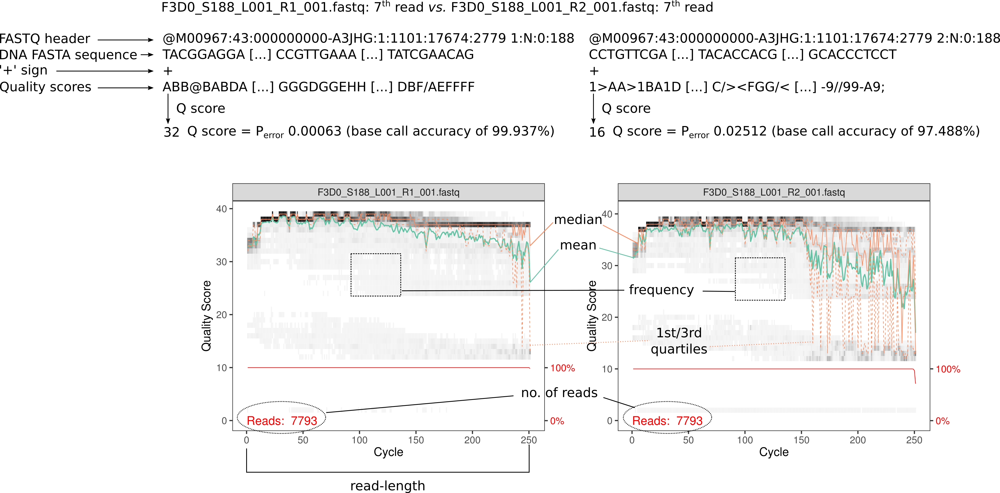
</figure></center>

<br>

It is based on the interpretation of these plots that you can make a supported decision latter about the parameters that you will choose to filter and trim the fastq files. Therefore, apply the `dada2` function `plotQualityProfile()` in order to get the quality profiles for forward and reverse files. Give as input/argument the vector list of forward and reverse fastq files: `fastqFwdPath` and `fastqRevPath`.

<br>


```r
### Plot the quality profiles 

plotQualityProfile(fl = fastqFwdPath) # plot the fastq profiles for the forward fastq files 
```

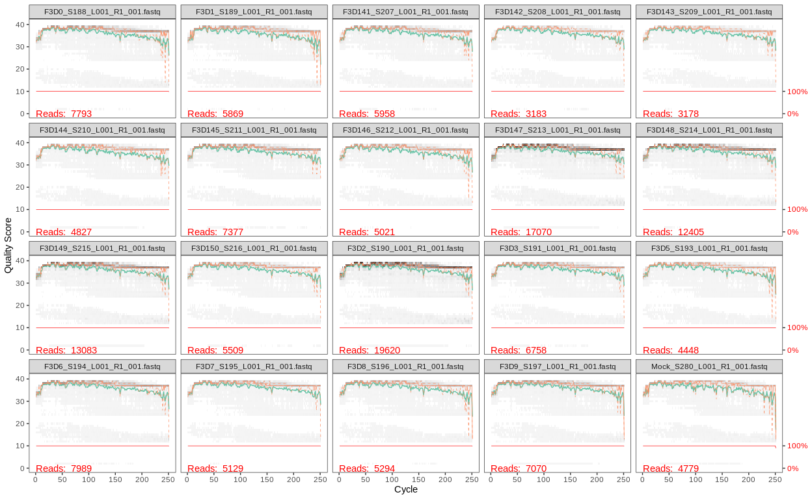

```r
plotQualityProfile(fl = fastqRevPath) # plot the fastq profiles for the reverse fastq files 
```

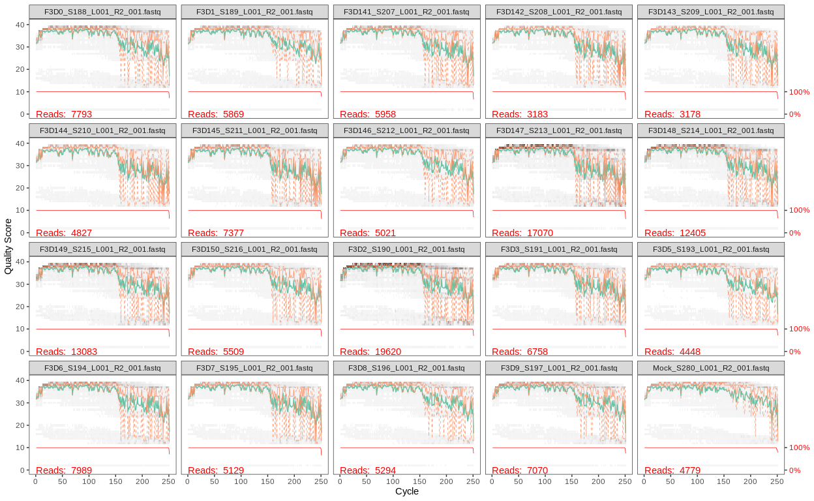

<br>

*Question*: **Based on the interpretation of these plots, would you say that forward and reverse fastq files are similar in terms of quality?** *(1 min)*

<details><summary><i>Answer</i></summary><p>
No! This is because the sequencing-by-synthesis (the method used by Illumina technology) is based on enzymatic reactions that have less efficiency to incorporate nucleotides in the reverse direction <i>3'-->5'</i>. Of course that the enzyme kinetics also drops in efficiency at the begining of each read and at the end of each read, no matter the direction, but often this is much more pronounced in reverse reads. 
</p></details>

<br>


### (1) Filter and trim reads
*(15 min)*

Filter and trim fastq files based on quality parameters is an essential step in the analysis of 16S rRNA gene amplicon NGS data. It is really important to use very stringent parameters to try to filter and trim out any sequencing error. Latter we will perform the *denoising* step which tries to remove sequencing reads with errors, but the more errors you have it will discard more sequences. It is well known in NGS data analysis in general that removing errors improves the performance of dowstream data analysis.

<br>

<details><summary><b>Bioinformatic jargon</b></summary><p>
<b>Truncation</b>: it refers to the action of cutting the reads at some specific bp position in order to have all reads with the same length. If you truncate your reads at 200 bp, it means that you will not have reads less neither higher than 200 bp long.  

<b>Trimming</b>: it refers to the action of cutting the 5'- or/and 3'-ends from your reads. It includes trim out the adapters, barcodes and primers from your reads.  
</p></details>

<br>

<center><figure>
   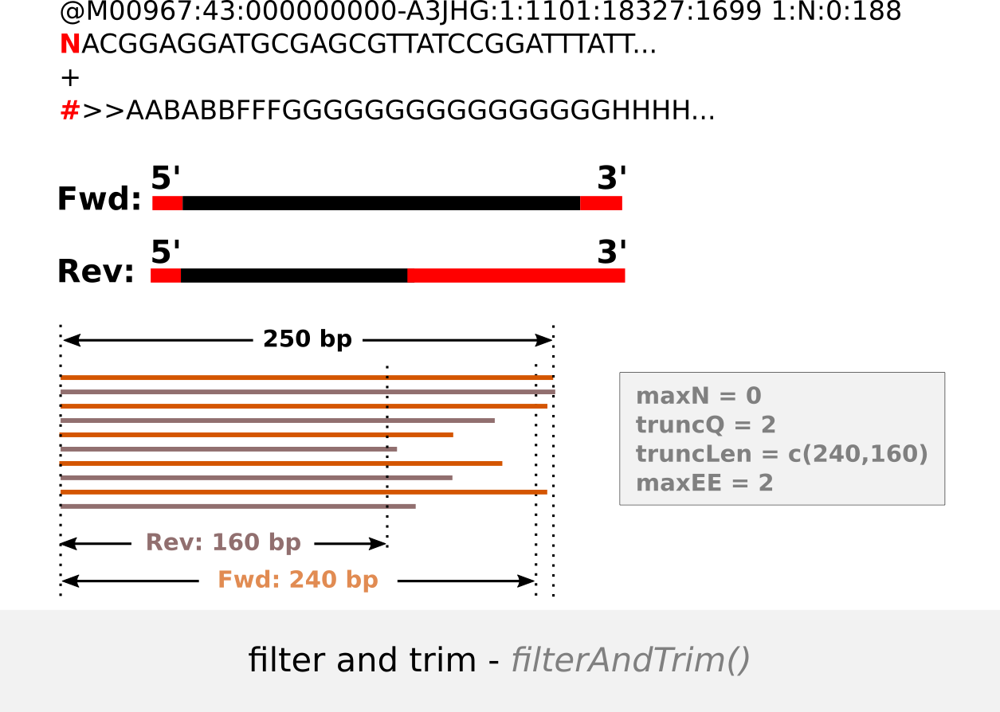
</figure></center>

<br>

<details><summary>I want to know more!</summary><p>

Q score - `truncQ`: here we will use a conservative quality score of 2 meaning that if a read has at some position a Q score ≤ 2 (this means that has a base-call accuracy of < 50%), truncate the read at that position. If the read-length after truncating this read is less than the truncation length (`truncLen` see below), discard the read. Set `truncQ = 2` for both, forward and reverse reads (if you put only one number it will assume the same for `forward` and `reverse` reads, otherwise put `truncQ = c(2,3)` if you want to set a different Q score for `forward` and `reverse` reads).

Read-length - `truncLen`: the Q scores start to drop close to the 250 bp end of forward reads and after the 150 bp for the reverse reads. Thus a good read-length would be the truncation of forward and reverse reads at 240 and 160 bp positions, respectively, *i.e*, `truncLen = c(240, 160)`. 

Other important parameters to have into consideration are the number of ambigous, aka **N**, bases (`maxN` parameter in the function `filterAndTrim` below) and *expected errors* (`maxEE`). Usually the no. of ambiguous bases allowed is zero because you do not want to keep reads with bases that you do not know what they are. Any read with ambiguous bases will be discarded - `maxN = 0`. The *maximum expected errors* for forward and reverse reads will be the same 2 - `maxEE = 2` because the sequencing error in Illumina is around 1%, so let's allow 2 mismatches along 200 bp length.

Since the bacterial phage DNA is widely used as a control in sequencing facilities, the parameter `rm.phix = TRUE` will search for reads that align against the phiX genome and discard them. The option `compress = TRUE` is given to compress the filtered fastq files (that's why they have the file extension **'.gz'**). The parameter `multithread` for the function `filterAndTrim` is to parallelize the jobs but does not work for Windows. So if you want to run this pipeline on Windows operating system just set this parameter to  `multithread = FALSE`. 

In this case the 16S rRNA gene region sequenced was the **V4 region** that is around 253 bp long. This means that our forward and reverse 250 bp long reads fully overlap. When you are truncating paired-end sequencing data you should be aware that after **truncation** reads should overlap at least over a 20 bp long region (a minimum of 12 perfect matches between forward and reverse reads ends - without mismatches). Otherwise you will not be able to merge the forward and reverse reads latter on.
</p></details>

<br>


Run the next R chunk code to apply the *filtering and trimming* with the `dada2` function `filterAndTrim()`. The `filterAndTrim()` function performs the filtering and trimming as specified in the parameters and write the output, *i.e.*, the fastq filtered files, to the directories specified below `filtFastqFwdPath` (for forward fastq files) and `filtFastqRevPath` (for reverse fastq files) and also prints/gives the number of sequences that were kept after filtering/trimming in relation to the initial number of reads. 


```r
### Filter and trim reads

filtFastqFwdPath <- file.path(fastqPath, "filtered", paste0(sampleNames, "_fwd_filt.fastq.gz")) # relative file path for fwd filtered reads that will be created below 
filtFastqRevPath <- file.path(fastqPath, "filtered", paste0(sampleNames, "_rev_filt.fastq.gz")) # relative file path for rev filtered reads that will be created below

## assign to each file path the sample name
names(filtFastqFwdPath) <- sampleNames 
names(filtFastqRevPath) <- sampleNames

## filter and trim fwd and rev fastq files writing the new filtered files in compressed - '.gz' - format to the directories specified above
filterTrimReads <- filterAndTrim(fwd = fastqFwdPath, filt = filtFastqFwdPath, rev = fastqRevPath, filt.rev = filtFastqRevPath, truncLen = c(240,160), maxEE = 2, truncQ = 2, maxN = 0, rm.phix = TRUE, compress = TRUE, verbose = FALSE, multithread = TRUE) 

knitr::kable(filterTrimReads) # fancy way to print the matrix, you could just do 'filterTrimReads'
```

| | reads.in |  reads.out | 
| ------------------------------ | :---------: | ----------:|
|F3D0_S188_L001_R1_001.fastq     |     7793    |    7113 |
|F3D1_S189_L001_R1_001.fastq      |    5869    |    5299|
|F3D141_S207_L001_R1_001.fastq    |   5958     |   5463|
|F3D142_S208_L001_R1_001.fastq   |    3183     |   2914|
|F3D143_S209_L001_R1_001.fastq   |    3178     |   2941|
|F3D144_S210_L001_R1_001.fastq   |    4827     |   4312|
|F3D145_S211_L001_R1_001.fastq   |    7377     |   6741|
|F3D146_S212_L001_R1_001.fastq   |    5021     |   4560|
|F3D147_S213_L001_R1_001.fastq   |   17070     |  15637|
|F3D148_S214_L001_R1_001.fastq   |   12405     |  11413|
|F3D149_S215_L001_R1_001.fastq   |   13083     |  12017|
|F3D150_S216_L001_R1_001.fastq   |    5509     |   5032|
|F3D2_S190_L001_R1_001.fastq     |   19620     |  18075|
|F3D3_S191_L001_R1_001.fastq     |   6758      |  6250|
|F3D5_S193_L001_R1_001.fastq     |   4448      |  4052|
|F3D6_S194_L001_R1_001.fastq     |   7989      |  7369|
|F3D7_S195_L001_R1_001.fastq     |   5129      |  4765|
|F3D8_S196_L001_R1_001.fastq     |   5294      |  4871|
|F3D9_S197_L001_R1_001.fastq     |   7070      |  6504|
|Mock_S280_L001_R1_001.fastq     |   4779      |  4314|

<br>

*Question*: **How many reads did you loose during the *filter and trim* step?** *(2.5min)*

><p><font size=2>Tip: the following command assigns the percentage of reads lost during this step to the `filterTrimReadsDiscard` R object: `filterTrimReadsDiscard <- (filterTrimReads[,"reads.in"] - filterTrimReads[,"reads.out"]) / filterTrimReads[,"reads.in"] * 100`. Run the previous command and give the ouput `filterTrimReadsDiscard` to the function `summary()` to summarise the no. of reads lost
</p></font>

<details><summary><i>Answer</i></summary><p>

So, the solution is: 
`filterTrimReadsDiscard <- (filterTrimReads[,"reads.in"] - filterTrimReads[,"reads.out"]) / filterTrimReads[,"reads.in"] * 100`
`summary(filterTrimReadsDiscard)`

The percentage of reads lost during the *(1) Filter and trim reads* step was between 7.0969-10.6691527%. 
</p></details>

<br>

Let's look again to the quality of forward and reverse reads after we had applied the filtering/trimming. 

<br>

*Question*: **Plot the quality profile of your forward and reverse good-quality/filtered reads with the function `plotQualityProfile()`. Which object do you need to give to this function? Are the quality profiles better than before we had applied the filtering/trimming?** *(2 min)*

<details><summary><i>Answer</i></summary><p>

You need to pass the object that contains the path to the filtered forward or reverse fastq files to the function `plotQualityProfile()`: `filtFastqFwdPath` (object with a list of relative paths to the filtered forward fastq files) and `filtFastqRevPath` (object with a list of relative paths to the filtered reverse fastq files). 


```r
# forward quality plots
plotQualityProfile(fl = filtFastqFwdPath) # list of paths to the forward filtered fastq files
```


```r
# reverse quality plots
plotQualityProfile(fl = filtFastqRevPath) # list of paths to the reverse filtered fastq files
```


Yes, the quality of the filtered forward and reverse reads looks much better now. 
</p></details>

<br>


### (2) Estimate error rates
*(10 min)*

This step tries to learn/estimate the *error rate* which is independent for each amplicon NGS run. The most common sequencing errors in Illumina are substitutions (Metzker et al. 2010). Therefore during this step **dada2** tries to estimate/infer error rates for all possible transition or transversion point mutations. The figure below describes how the table of **transition probabilities** is generated. 

<br>

<center><figure>
  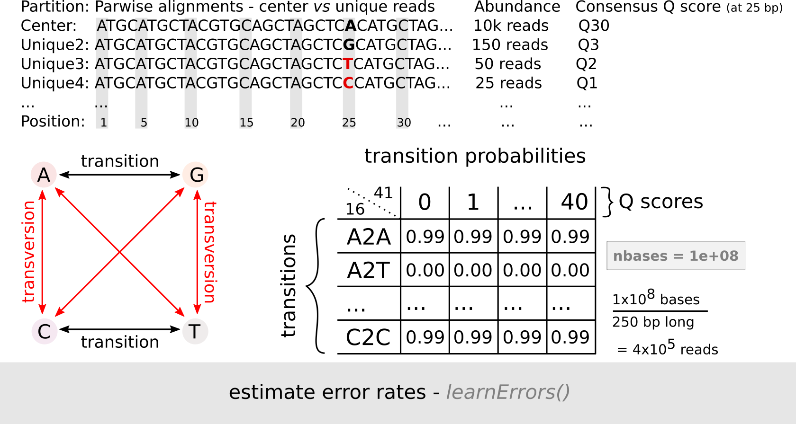
</figure></center>

<br>

Run the R chunk code below to estimate the error rate for forward and reverse reads with the `dada2` function: `learnErrors()`. This function takes as input the forward or reverse (so, independently) filtered fastq files: `filtFastqFwdPath` or `filtFastqRevPath`. This step is more computational intensive than any other done before. 


```r
### Learn error rates

errFwd <- learnErrors(fls = filtFastqFwdPath, multithread = TRUE) # model/learn the fwd error rates for the filtered fastq files
```

```
## 33514080 total bases in 139642 reads from 20 samples will be used for learning the error rates.
```

```r
errRev <- learnErrors(fls = filtFastqRevPath, multithread = TRUE) # model/learn the rev error rates for the filtered fastq files
```

```
## 22342720 total bases in 139642 reads from 20 samples will be used for learning the error rates.
```


Run the R chunk code below to plot the expected and observed error rate for forward and reverse reads. 

   + <span style="color:black">**points**</span>: observed error rate for each consensus Q score
   
   + <span style="color:black">**line**</span>: estimated error rates
   
   + <span style="color:red">**line**</span>: expected under the nominal definition of the Q score 


```r
## Plot errors 

plotErrors(dq = errFwd, nominalQ = TRUE) # for fwd
```


```r
plotErrors(dq = errRev, nominalQ = TRUE) # for rev
```


<br>


### (3) Denoise unique sequences (dereplicate and exclude singletons)
*(15 min)*

The next step in the pipeline is the core algorithm of **DADA2** that performs the *inference* of *Amplicon Sequence Variants* (ASVs) based on the previous estimated error rates. In addition, it dereplicates reads into unique sequences (100% identical) and remove singletons. Have a look into the figure below: 

<br>

<center><figure>
  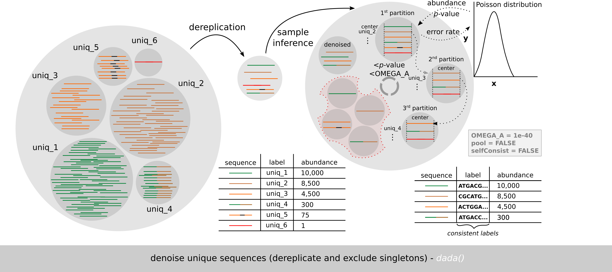
</figure></center>

<br>

Run the R chunk code below in order to *dereplicate*, *denoise* (=*sample inference*) and *exclude singletons*. We will give as input to the `dada2` function that performs this step - `dada()` - the filtered fastq sequences and the error models for forward and reverse reads that we have determined before.

<details><summary>I want to know more!</summary><p>
The output is a list of samples from `dada-class` that contains the **Amplicon Sequence Variants** (among other useful information: "denoised", "clustering", "sequence", "quality", "birth_subs", "trans", map", "err_in", "err_out", "opts", "pval"). Do `?dada()` to know more about this function, parameters and the ouput and its meaning.
</p></details>

<br>

```r
### Denoising  
dadaFwd <- dada(derep = filtFastqFwdPath, err = errFwd, multithread = TRUE) # denoise fwd seqs
```

```
## Sample 1 - 7113 reads in 1979 unique sequences.
## Sample 2 - 5299 reads in 1639 unique sequences.
## Sample 3 - 5463 reads in 1477 unique sequences.
## Sample 4 - 2914 reads in 904 unique sequences.
## Sample 5 - 2941 reads in 939 unique sequences.
## Sample 6 - 4312 reads in 1267 unique sequences.
## Sample 7 - 6741 reads in 1756 unique sequences.
## Sample 8 - 4560 reads in 1438 unique sequences.
## Sample 9 - 15637 reads in 3590 unique sequences.
## Sample 10 - 11413 reads in 2762 unique sequences.
## Sample 11 - 12017 reads in 3021 unique sequences.
## Sample 12 - 5032 reads in 1566 unique sequences.
## Sample 13 - 18075 reads in 3707 unique sequences.
## Sample 14 - 6250 reads in 1479 unique sequences.
## Sample 15 - 4052 reads in 1195 unique sequences.
## Sample 16 - 7369 reads in 1832 unique sequences.
## Sample 17 - 4765 reads in 1183 unique sequences.
## Sample 18 - 4871 reads in 1382 unique sequences.
## Sample 19 - 6504 reads in 1709 unique sequences.
## Sample 20 - 4314 reads in 897 unique sequences.
```

```r
dadaRev <- dada(derep = filtFastqRevPath, err = errRev, multithread = TRUE) # denoise rev seqs
```

```
## Sample 1 - 7113 reads in 1660 unique sequences.
## Sample 2 - 5299 reads in 1349 unique sequences.
## Sample 3 - 5463 reads in 1335 unique sequences.
## Sample 4 - 2914 reads in 853 unique sequences.
## Sample 5 - 2941 reads in 880 unique sequences.
## Sample 6 - 4312 reads in 1286 unique sequences.
## Sample 7 - 6741 reads in 1803 unique sequences.
## Sample 8 - 4560 reads in 1265 unique sequences.
## Sample 9 - 15637 reads in 3414 unique sequences.
## Sample 10 - 11413 reads in 2522 unique sequences.
## Sample 11 - 12017 reads in 2771 unique sequences.
## Sample 12 - 5032 reads in 1415 unique sequences.
## Sample 13 - 18075 reads in 3290 unique sequences.
## Sample 14 - 6250 reads in 1390 unique sequences.
## Sample 15 - 4052 reads in 1134 unique sequences.
## Sample 16 - 7369 reads in 1635 unique sequences.
## Sample 17 - 4765 reads in 1084 unique sequences.
## Sample 18 - 4871 reads in 1161 unique sequences.
## Sample 19 - 6504 reads in 1502 unique sequences.
## Sample 20 - 4314 reads in 732 unique sequences.
```

<br>

Now, it would be interesting to know how many *denoised* sequences we obtained *per* sample. With this in mind, run the next R chunk code. 

<br>

```r
## get the no. of unique and ASVs for fwd
source("./scripts/biodataPtCrashCourse.R") # import the in-house-developed functions 
uniqFwd <- countUniqueFromDadaObjcList(dadaFwd)[["unique"]] ## count unique Fwd seqs
denoisedFwd <- countUniqueFromDadaObjcList(dadaFwd)[["denoised"]] ## count denoised Fwd seqs

## get the no. of unique and ASVs for rev
uniqRev <- countUniqueFromDadaObjcList(dadaRev)[["unique"]]
denoisedRev <- countUniqueFromDadaObjcList(dadaRev)[["denoised"]]

## total reads
total <- filterTrimReads[,"reads.in"] # retrieve the total no. of seqs
names(total) <- sampleNames # rename samples

## now lets join these two vectors to the previous matrix (with absolute abundance)
denoisedMtx <- rbind(total, uniqFwd, uniqRev,  denoisedFwd, denoisedRev) # you need be careful when you are joining vectors indiscriminately
#here we are joining the vectors assuming that the order of elements between vectors and the matrix is the same. However this was verified by us...if you sorted your samples in the beginning, in principle, the sample order should remain the same

## Barplot with total, unique and denoised fwd and rev sequences
#barplot(denoisedMtx, main = "Comparison of the no. of total, unique and denoised sequences", xlab = "Samples", ylab = "Absolute no. of sequences", col = c("#EFF3FF", "#BDD7E7", "#6BAED6", "#3182BD", "#08519C"), legend = rownames(x = denoisedMtx), beside = TRUE)

## Barplot only denoised fwd and rev sequences
barplot(denoisedMtx[4:5,], main = "Comparison of the no. of denoised sequences: forward vs. reverse", xlab = "Samples", ylab = "Absolute no. of sequences", col = c("#3182BD", "#08519C"), legend = rownames(x = denoisedMtx[4:5,]), beside = TRUE) # notice that we are running the same plot as before, but this time we indexed the matrix to plot only the last two rows, the ones that contain the no. of denoised forward and reverse reads
```


On average there are 110.9 and 98.15 denoised sequences in the forward and reverse sample files. The mock sample has 21 (forward) and 19 (reverse) denoised sequences, that is pretty much the number of strains in this sample: 20.


<br>

*Question*: **Why we can not call already these *denoised* sequences *ASVs* sequences?** *(1 min)*

<details><summary><i>Answer</i></summary><p>
  
These denoised sequences still need to be merged (and we can loose some of these *true sequences* during this step) and may have chimeric sequences among them. Therefore, despite denoised (without sequencing errors) that does not mean that *chimeric sequences*, that arise before sequencing but it constitutes spurious/artificial sequences, can not be among these *true biological sequences*. 
</p></details>

<br>


### (4) Merge denoised forward and reverse reads
*(5-10 min)*

After denoising, we will merge our forward reads with the respective reverse-complement of the reverse reads (have a look into the figure below). 

<br>

<center><figure>
  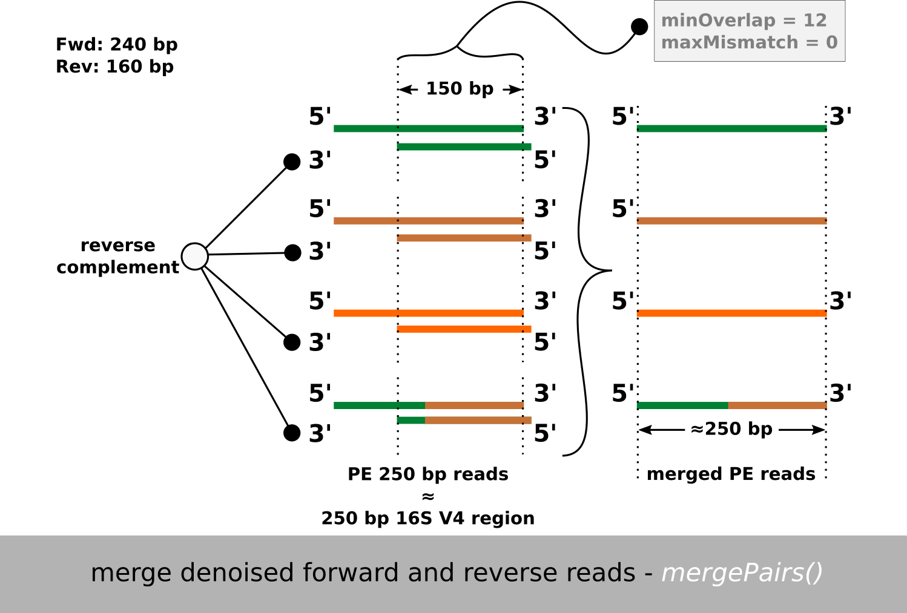
</figure></center>

<br>

<details><summary>I want to know more!</summary><p>
The forward reads and the reverse-complement of the reverse reads should overlap along a minimum of 12 bases without any mismatch (`maxMismatch` allowed in the `minOverlap` region is `0` by default). By default, if forward and the reverse-complement of reverse reads does not overlap, reads are discarded as well forward and reverse reads that does not have their pair. 
</p></details>

<br>

Run the following R chunk code in order to merge paired-end reads with the `dada2` function: `mergePairs()`. Notice that we are giving as input the denoised forward and reverse objects - `dadaFwd` and `dadaRev` - as well as the filtered forward and reverse fastq file paths - `filtFastqFwdPath` and `filtFastqRevPath`. The output is a list of data frames. 

<br>

```r
### Merge paired-end reads
mergePE <- mergePairs(dadaF = dadaFwd, derepF = filtFastqFwdPath, dadaR = dadaRev, derepR = filtFastqRevPath, verbose = TRUE) # merge PE reads
```

<br>


### (5) Construct an ASV table
*(5 min)*

Now, we will build our *Amplicon Sequence Variant* table (however, it still contains chimeras!). 

<br>

<center><figure>
  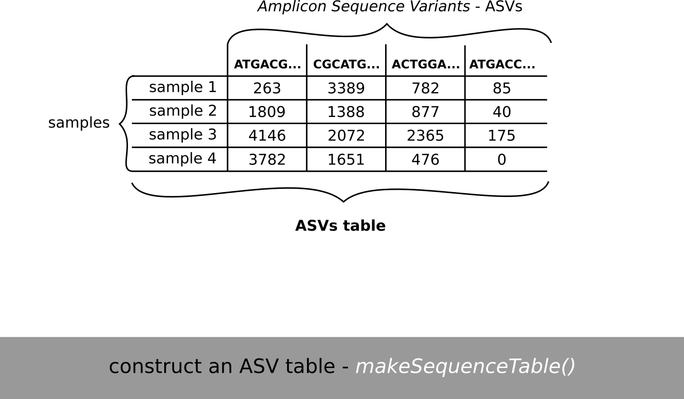
</figure></center>

<br>

For that, we will use the `dada2` function `makeSequenceTable()` giving as input the previous R object with merged reads: `mergePE`. The ouput is one *ASV* matrix/table with the distribution of **ASVs** (columns) across samples (rows). 


```r
### Make an ASV table

asvTbl <- makeSequenceTable(samples = mergePE) # tabulate ASVs
```

<br>
  
At this point is also interesting to check the length distribution of our reads after being merged. This is important because after merging you may get weird sequence lengths that does not correspond to the sequence length of our target region - around 250 bp (v4 region of the 16S rRNA gene).  

<br>
  
  
  ```r
histSeqLen <- table(nchar(getSequences(asvTbl))) # the dada2 function `getSequences()` retrieve the column name sequences and the `nchar()` counts the read-lenth of that sequences, and, finally the `table()` counts the frequency of read-length   
```

<br>
  
*Question*: **What do you think about the read-length of these ASVs? How many ASVs do we have in `asvTbl`?** *(2.5 min)*
  
><p><font size=2>Tip: try to plot an histogram with the vector <code>nchar(getSequences(asvTbl))</code> using the function <code>hist()</code> to check the read-length. Try to use the function <code>dim()</code> or <code>ncol()</code> with <code>asvTbl</code> R object to get information about the number of ASVs in our dataset.</font></p>
  
<details><summary><i>Answer</i></summary><p>
  
If you just print the R object `histSeqLen` you will see that the read-length of our ASVs have a proper read-length around 250 bp, as expected.

`dim(asvTbl)` gives you the dimension of the `asvTbl` matrix and by extension the dimension of our dataset: 20 samples and 293 ASVs.


Solution to plot the histogram: 
  
  
  ```r
hist(nchar(getSequences(asvTbl)))
```


</p></details>
  
<br>

<details><summary>What can I do if some of my reads have a read-length lower/higher than expected?</summary><p>
  
Let's imagine that for some reason you found sequences higher than 255 bp, with some around 300 bp. In this case you would like to remove them to keep only ASV sequences between 250-256 bp long. For that you could just do: `asvTbl2 <- asvTbl[,nchar(colnames(asvTbl)) %in% 250:256])`. This will pick the previous ASV table, keeping only the ASV columns (`colnames(asvTbl)`) with a read-length (`nchar(colnames(asvTbl))`) between 250-256 bp (`%in% 250:256`). Keep in mind if you work with different amplicon regions or genes, it could be beneficial to keep sequences that vary in length because the natural interspecific variation due to indels - for instance if you work with ITS (Internal transcribed spacer - ITS1 and 2 vary between 200-600 bp) gene often used as marker gene in *Fungi*. 

</p></details>

<br>


### (6) Remove chimeras
*(15 min)*

The next step in `dada2` pipeline is the identification and removal of ASVs that may represent chimeric sequences. 

<br>

<center><figure>
  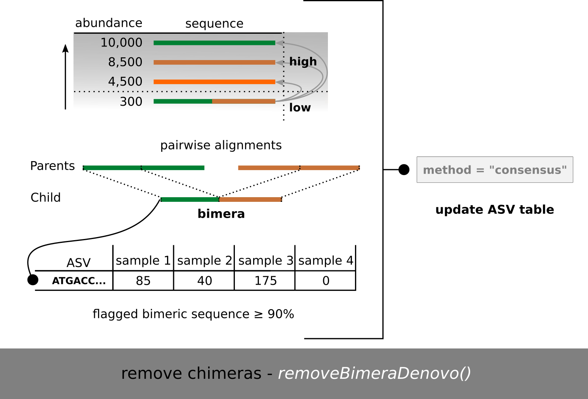
</figure></center>

<br>

<details><summary>I want to know more!</summary><p>
For this purpose, we will use the `dada2` function `removeBimeraDenovo()` with the `method = "consensus"`. So this method is based on the function `isBimera()` that assumes chimeras arise during PCR with incomplete amplifications and subsequent pairing giving origin to chimeric sequences that result from two incomplete true/parent sequences. Well, the assumptions are: chimeric sequences arise from two pre-existing true/parents sequences, and, based on probability, if this happens, it happens probably with the most abundant sequences that are being amplified. Thus, this method ranks all the ASVs sequences and it compares the less abundant sequences with the most abundant sequences. If one of the less abundant ASVs sequences have high identity with two abundant ASVs sequences, it is flagged as **chimeric**. The `method = "consensus"` does this in a sample basis, *i.e.*, it searches for chimeras in each sample and then it removes the flagged *chimeric* ASVs sequences if the same chimeric sequence appeared *flagged* in a sufficiently high no. of samples. It ouputs an **ASV table** without chimeras. 
</p></details>

<br>

Run the R chunk code below to remove chimeras from the *ASV table*. Give as input the `asvTbl` R object created before to the `dada2` `removeBimeraDenovo()` function with the argument `method = "consensus"`. 


```r
### Remove chimeras from the ASV table

asvTblNoChim <- removeBimeraDenovo(unqs = asvTbl, method = "consensus", multithread = TRUE, verbose = TRUE) 
```

<br>

*Question*: **How many ASVs did you get? How many ASVs did you loose during this step?** *(1.5 min)*

><p><font size=2>Tip: try to use the <code>ncol()</code> function that gives you the number of columns that a matrix or dataframe R objects have with the <code>asvTbl</code> (before removing chimeras) and <code>asvTblNoChim</code> (after removing chimeras) R objects (don't forget that in our case the columns of these ASV tables contains the ASVs found in the mouse fecal dataset).</font></p>
  
<details><summary><i>Answer</i></summary><p>
  
The `asvTblNoChim` ASV table contains 232 ASVs. During the *remove chimeras* step we lost 61 ASVs marked as chimeric sequences.
</p></details>
  
  <br>
  
Since now we have the final ASV table we can summarize the number of sequences that was kept in each step of the pipeline. 

<details><summary>I want to know more!</summary><p>
For that, run the following piece of R code. Basically, we are creating a function to count the no. of unique sequences from previous R objects - `getN()` - and then building a new matrix with `cbind()` that contains in each column the no. of sequences that were kept in each sample, with different columns representing distinct steps in the pipeline. Then, we rename the columns and rows of the matrix that we created - `summaryTblSeq`. Finally, we save this matrix with the function `write.table()` inside the folder `output` just created with `dir.create()` function before.  
</p></details>

<br>

```r
### Summarize the no. of sequences kept in each pipeline step

getN <- function(x) sum(getUniques(x)) # function that sums `sum(getUniques(x)` the no. of unique sequences `getUniques(x)`

## build a matrix with all the sequences kept in each pipeline step
summaryTblSeq <- cbind(filterTrimReads, # initial reads and filtered/trimmed reads
                       sapply(dadaFwd, getN), sapply(dadaRev, getN), # denoised sequences 
                       sapply(mergePE, getN), # merged PE sequences
                       rowSums(asvTblNoChim)) # non-chimeric sequences

## rename the column and row names 
colnames(summaryTblSeq) <- c("input", "filtered", "denoisedF", "denoisedR", "merged", "nonchim")
rownames(summaryTblSeq) <- sampleNames

## create a second summary table seq with one column for the samples 
summaryTblSeq2 <- cbind("Samples" = sampleNames, summaryTblSeq)

dir.create("output") # let's create 'output' folder
write.table(x = summaryTblSeq2, file = "./output/summaryTblSeq.tsv", sep = "\t", row.names = FALSE)

knitr::kable(summaryTblSeq)
```

|        |  input  | filtered |  denoisedF |  denoisedR |  merged  | nonchim |
  |------- | :------: |  :---------: |  :----------: | :----------: | :-------: |  :-------- |
  |F3D0    |   7793   |    7113    |    6976    |    6979  |   6540   |   6528|
  |F3D1    |   5869   |    5299    |    5227     |   5239  |   5028   |   5017|
  |F3D141  |   5958   |    5463    |    5331     |   5357  |   4986   |   4863|
  |F3D142  |   3183   |    2914    |    2799     |   2830  |   2595   |   2521|
  |F3D143  |   3178   |    2941    |    2822    |    2867  |   2552   |   2518|
  |F3D144  |   4827   |    4312    |    4151    |    4228  |   3627   |   3488|
  |F3D145  |   7377   |    6741    |    6592    |    6627  |   6079   |   5820|
  |F3D146  |   5021   |    4560    |    4450    |    4470  |   3968   |   3879|
  |F3D147  |  17070   |   15637    |   15433    |   15507  |  14231   |  13006|
  |F3D148  |  12405   |   11413    |   11250    |   11268  |  10529   |   9935|
  |F3D149  |  13083   |   12017    |   11857    |   11898  |  11154  |   10653|
  |F3D150  |   5509   |    5032    |    4880    |    4925  |   4349  |    4240|
  |F3D2    |  19620   |   18075    |   17907    |   17939  |  17431  |   16835|
  |F3D3    |   6758   |    6250    |    6149    |    6176   |  5853  |    5491|
  |F3D5    |   4448   |    4052    |    3930    |    3994   |  3716  |    3716|
  |F3D6    |   7989   |    7369    |    7231    |    7294  |   6865  |    6679|
  |F3D7    |   5129   |    4765    |    4646    |    4673  |   4428  |    4217|
  |F3D8    |   5294   |    4871    |    4786    |    4802  |   4576  |    4547|
  |F3D9    |   7070   |    6504    |    6341    |    6442  |   6092  |    6015|
  |Mock    |   4779   |    4314    |    4287    |    4288  |   4269  |    4269|
  
  <br>
  
*Question*: **How many sequences remained through the pipeline?** *(1 min)*
  
><p><font size=2>Tip: the `summaryTblSeq[,6] / summaryTblSeq[,1] * 100` expression gives you the percentage of sequences that remained since the beginning. Use this expression with the `summary()` function to get some statistics about the sequences kept through the pipeline</font></p>
  
  <details><summary><i>Answer</i></summary><p>
  
The number of sequences that remained through the whole pipeline was on average: 81.4552543% (83.7674836, 85.4830465, 81.6213494, 79.2020107, 79.2322215, 72.260203, 78.8938593, 77.2555268, 76.19215, 80.0886739, 81.4262784, 76.9649664, 85.8053007, 81.2518497, 83.5431655, 83.6024534, 82.2187561, 85.8896864, 85.0777935, 89.3283114).
</p></details>
  
<br>
  
Let's plot the no. of sequences kept in each step since the beginning. Run the R chunk code below to get a barplot with the absolute number of sequences obtained across each step of the pipeline (run the R chunk below). 

<details><summary>I want to know more!</summary><p>
Basically, what the R chunk code are doing is transposing the matrix built above `summaryTblSeq` to inverte the rows into columns and columns into rows with the `t()` function. We are doing this because then to plot and get the *samples* name across the x-axis, these samples name needs to be spread across columns and not rows (as before). Then, we give the transposed `summaryTblSeqTrans` matrix (with samples as columns) to the function `barplot()` in order to do a barplot. 
</p></details>

<br>

```r
### Barplot with the abs. abundance of sequences

summaryTblSeqTrans <- t(summaryTblSeq) # transpose 
barplot(summaryTblSeqTrans, main = "Absolute no. of sequences kept through the pipeline", ylab = "Absolute no. of sequences", xlab = "Samples", col = c("gray", "#EFF3FF", "#BDD7E7", "#6BAED6", "#3182BD", "#08519C"), legend = rownames(summaryTblSeqTrans), beside = TRUE)
```


<br>

Now, we will do the same as before but this time we will plot the percentage of sequences kept through the pipeline (run the R chunk below). 

<details><summary>I want to know more!</summary><p>
For that, we need to determine the percentage of sequences kept for each step in the pipeline. For this we can use the function `apply()` that can be used to `apply` another function, in this case we are applying the `function(x) x / summaryTblSeq[,1] * 100` (to get the percentage of sequences per sample), across a matrix rows or columns (in our case we are applying the function across the matrix columns setting `MARGIN = 2`). Then, we transpose with `t()` and plot with `barplot()`. Run the R code chunk below to get the barplot. 
</p></details>

<br>


```r
### Barplot in percentage

summaryTblSeqPerc <- apply(X = summaryTblSeq, MARGIN = 2, function(x) x / summaryTblSeq[,1] * 100) # get the correspondent percentage table
summaryTblSeqPercTrans <- t(summaryTblSeqPerc) # transpose
barplot(summaryTblSeqPercTrans, main = "Percentage of sequences kept through the pipeline", ylab = "Percentage of sequences (%)", xlab = "Samples", col = c("gray", "#EFF3FF", "#BDD7E7", "#6BAED6", "#3182BD", "#08519C"), legend = rownames(summaryTblSeqPercTrans), beside = TRUE) # plot it 
```


<br>


### (7) Assign taxonomy
*(15 min)*

The last step in the pipeline is the taxonomic classification of the ASV sequences. This is also one of the most computational intensive steps in the pipeline (check the figure below).

<br>

<center><figure>
  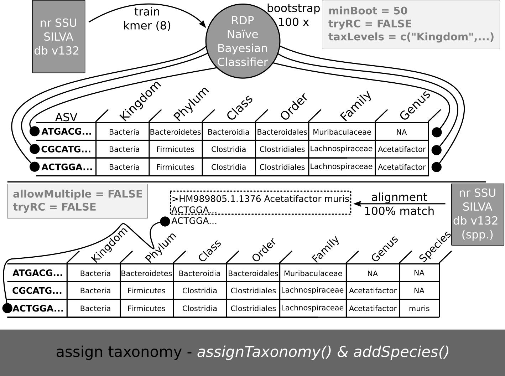
</figure></center>

<br>

<details><summary>I want to know more!</summary><p>
1<sup>st</sup> we classify the ASVs against the non-redundant SILVA database (version 132) (Quast et al. 2012) (keep in mind that there is a new version of SSU SILVA database - 138 - but it is not formatted for `dada2` yet) with the RDP Naive Bayesian Classifier algorithm (Wang et al. 2007) implemented in R through the `dada2` function `assignTaxonomy()` (with a minimum of condidence of 50% `minBoot = 50`), and, 2<sup>nd</sup> tries to assign the species name based on 100% exact match with the `dada2` function `addSpecies()` (retrieving only unambigous matches). It outputs the taxonomy matrix table for our ASVs.
</p></details>

<br>

Run the R chunk code below to classify taxonomically your ASVs. 


```r
### naive Bayes classifier

taxTbl <- assignTaxonomy(seqs = asvTblNoChim, refFasta = "./database/silva_nr_v132_train_set.fa.gz", multithread = TRUE) # assign taxonomy against the SILVA NR database (version 132)

## add species

taxTbl <- addSpecies(taxtab = taxTbl, refFasta = "./database/silva_species_assignment_v132.fa.gz") # add species to the , previous assignment based on 100% match
```

<br>

*Question*: **What are the `rownames(taxTbl)` and `colnames(asvTblNoChim)`?** *(1 min)*

<details><summary><i>Answer</i></summary><p>

The row names of the matrix table `taxTbl` ànd the column names from the ASV matrix table `asvTblNoChim` are the ASV DNA sequences. This offers all the convenience of being a *consistent label*, but it is hard to manipulate, *e.g.*, if you need to know which is the taxonomy or abundance of the 3<sup>rd</sup> most abundant ASV (you will not write the full DNA sequence to index/query taxonomy and ASV tables).
</p></details>

<br>

Next save the `asvTblNoChim` and `taxTbl` R objects in *rds* format (R format) to the `output` folder in our working environment. Latter, if you need these untouched/not manipulated objects you can use the inverse function `readRDS()` to import/read these R objects into R. 


```r
### Save ASV and taxonomy tables in R format 
# this can be important if you need just these tables in R format to import latter instead of repeating the whole tutorial

saveRDS(object = asvTblNoChim, file = "./output/asvTblNoChim.rds") # save the ASV table
saveRDS(object = taxTbl, file = "./output/taxTbl.rds") # save the ASV taxonomy
```

<br>

Well, as you saw above the `rownames(taxTbl)` and `colnames(asvTblNoChim)` are the unique denoised DNA sequences of the *ASVs* found in this study. But it would be much better and easier to manipulate if we use shorter **ASV_ID** such as **ASV_nrSeq**, where the *nrSeq* is just the no. of the sequence in the table. Then, we can save the DNA sequences with this tag/id to keep track of the true unique identifiers of ASVs (have a look into the figure).

<br>

<center><figure>
  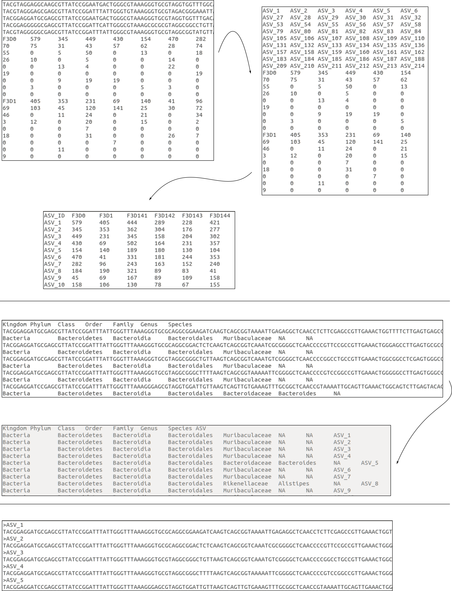
</figure></center>

<br>

<details><summary>I want to know more!</summary><p>
With this purpose in mind, we will run the R chunk code below. First, we will create a new taxonomic matrix table using the previous taxonomic matrix table `taxTbl` R object and adding to this a new column called `ASV` with `cbind()` (column bind) function. The new column contains the **ASV_nrSeq** labels, that will start in 1, *i.e.*, pasting `ASV` to `1` - `ASV_1` - with `paste()`, until the length of rows in `taxTbl`, *i.e.*, `nrow(taxTbl)` equal to `ASV_232`. Then, we will just set as row names of this new matrix the same  **ASV_nrSeq** labels just created before with `rownames(taxTbl2) <- taxTbl2[,8]`. Next, we will save the ASV sequences to the fasta file `asvFastaDNASequences.fasta`, inside the folder `output`, with the `dada2` `uniquesToFasta()` function, where the fasta headers/identifiers are the same as  **ASV_nrSeq** labels created before - `ids = taxTbl2[,8]` - (to keep trackability!). Finally, we will substitute also the ASV identifiers by the new  **ASV_nrSeq** labels in the ASV table - `asvTblNoChim` - as we did for the taxonomic table before: first we will copy the `asvTblNoChim` to `asvTblNoChim2`, then rename the ASV column names by the new  **ASV_nrSeq** labels with `colnames(asvTblNoChim2) <- taxTbl2[,8]`, transpose the columns into rows and vice-versa to have samples as columns (more convenient) - `asvTblNoChim2 <- t(asvTblNoChim2)` -, convert the matrix ASV table R object into a data frame - `asvTblNoChim2 <- as.data.frame(asvTblNoChim2)` -, add a new column with the new ASV labels - `asvTblNoChim2[,"ASV_ID"] <- rownames(asvTblNoChim2)` -, and remove the *mock community* (because this is a synthetic/control community that we want to remove from downstream analyses) that is the 20th column and put the 21st column - with the ASV labels - in the first column - `asvTblNoChim2 <- asvTblNoChim2[, c(21,1:19)]`. Save the taxonomic (`taxTbl.txt`) and ASV (`asvTblNoChim.txt`) tables inside the `output` folder in tab-delimited format.     
</p></details>

<br>

Run the R chunk code below.

```r
## keep the trackability of your ASVs 
taxTbl2 <- cbind(taxTbl, "ASV" = paste0("ASV_", 1:nrow(taxTbl))) # add a new column with the new ASV labels/ids to the taxonomy table
rownames(taxTbl2) <- taxTbl2[,8] # substitute the DNA sequences in rownames by the new identifiers/tags/ids "ASV_nrSeq" in the taxonomy table

## retrieve the DNA sequences 
uniquesToFasta(asvTblNoChim, "./output/asvFastaDNASequences.fasta", ids = taxTbl2[,8])

## do the same for the ASV table (with the distribution)
asvTblNoChim2 <- asvTblNoChim # copy ASV table
colnames(asvTblNoChim2) <- taxTbl2[,8] # substitute column DNA sequences names by "ASV_nrSeq" in the ASV table
asvTblNoChim2 <- t(asvTblNoChim2) # transpose the ASV matrix table 
asvTblNoChim2 <- as.data.frame(asvTblNoChim2)
asvTblNoChim2[,"ASV_ID"] <- rownames(asvTblNoChim2)
asvTblNoChim2 <- asvTblNoChim2[, c(21,1:19)] # remove the mock community and put the last as the first column

## Let's save these 2 R objs 
write.table(x = taxTbl2, file = "./output/taxTbl.txt", sep = "\t", row.names = FALSE, quote = FALSE) # save taxonomy table 
write.table(x = asvTblNoChim2, file = "./output/asvTblNoChim.txt", sep = "\t", row.names = FALSE, quote = FALSE) # save ASV table
# the code above assumes that the rownames(taxTbl) are in the same order of colnames(asvTblNoChim)
# if you have doubts about it you can run `rownames(taxTbl) == colnames(asvTblNoChim)` 
# this will compare all the entries between both vector lists all will return TRUE or FALSE if they are the same or not
```

<br>
  
In order to use the **Biome-Shiny** R app latter we need to create a **biom** file that contains the distribution of ASVs, *i.e.*, the abundance, across samples with taxonomy altogether. In order to convert the **ASV + Taxonomy table** into a **biom** file format latter, the taxonomy needs to follow some standards (see below). 
  
<br>

<center><figure>
  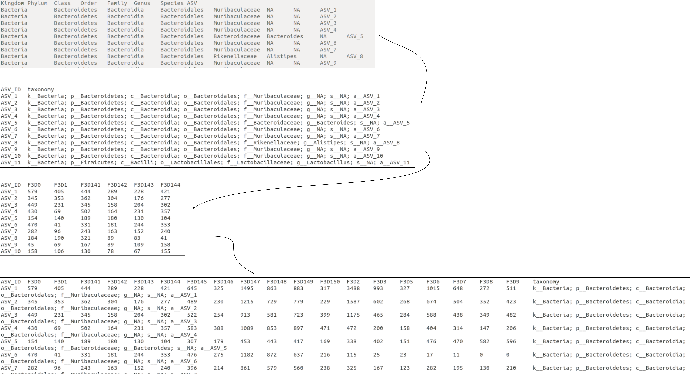
</figure></center>

<br>  

<details><summary>I want to know more!</summary><p>
To this purpose it was created a in-house-developed function `tax2biom()` in the `biodataPtCrashCourse.R` R script that performs the following taxonomy formatting:
  aggregates all taxonomic levels separated by '; ' with the prefix 'R__' (with R being substituted by the taxonomic rank at which belong, like Phylum, *e.g.*, 'p__', Class, 'c__', and so on). It will return a data frame with 2 columns: "ASV_ID" (gene/ASV) and "taxonomy" (full taxonomy path as it appears in Greengenes database - convenient to convert to biom format and import to Biome-Shiny app). 
</p></details>

<br>

Run the following R chunk code to get the ASV table merged with the new formatted taxonomy, saving it inside the `output` folder with the name `asvTaxTbl.txt` (tab-delimited format). The file `asvTaxTbl.txt` will be converted latter into **biom format** in order to use it with **Biome-Shiny**.

<br>
  
  
```r
## put taxonomy in a compatible format to convert it latter to biom format

source("./scripts/biodataPtCrashCourse.R") # import R script with in-house-developed functions
taxTbl2 <- tax2biom(taxTbl2) 

## Join ASV and Taxonomy tables into one
asvTaxTbl <- cbind(asvTblNoChim2, "taxonomy" = taxTbl2[,-1]) # exclude the "ID" first column from "taxTbl2" because "asvTblNoChim2" has already this information
write.table(x = asvTaxTbl, file = "./output/asvTaxTbl.txt", sep = "\t", row.names = FALSE, quote = FALSE) # save ASV-taxonomy tables
```

<br>
  
Below we are importing and formatting the `mouse.time.design` file that contains information about the fecal mouse samples used in this course and that will be used latter with the **Biome-Shiny** R app.

Run the R code chunk below to get the `metadata.csv` file formatted to use latter inside the `output` directory.

<br>
  
  
```r
### Import metadata and put it in a biom format too

metadata <- read.table("./MiSeq_SOP/mouse.time.design", header = TRUE)
rownames(metadata) <- metadata[,1]
colnames(metadata) <- c("SampleID", "Condition")
write.csv(x = metadata, file = "./output/metadata.csv", quote = FALSE, row.names = TRUE)
```

<br>
  
  
  
### Evaluate accuracy and contamination (with the *mock community*)
*(5 min)*

Now we will assess the accuracy of **DADA2** and possible contamination. For this purpose we will assess if **DADA2** was able to identify all the strains in the *mock community* correctly. If we identify a different bacterial ASV that was not present in the original *mock community* that means that something went wrong somewhere else between library prep and sequencing and you got your samples contaminated. However, this simple comparison does not discard contamination before library prep and sequencing. 

<details><summary>I want to know more!</summary><p>
First select only the `Mock` from the previous/untouch ASV table - `mockAsvTbl <- asvTbl["Mock",]` -, filter the vector R object `mockAsvTbl` to ASVs higher than `0` and ordered them from the most to less abundant - `mockAsvTbl <- sort(x = mockAsvTbl[mockAsvTbl>0], decreasing = TRUE)`. Then, import reference mock sequences from **HMP_MOCK.v35.fasta** - `refMockSeq <- getSequences(file.path(fastqPath, "HMP_MOCK.v35.fasta"))`. Finally, we compare the ASV sequences obtained in the *mock community* `names(mockAsvTbl)` with the with the reference sequences `refMockSeq` and we sum the number of matches. The total number of sequences identified in the *mock community* can be determined by: `length(mockAsvTbl)`. If the no. of mock ASVs is the same as the number of ASV sequences identified in the reference, *i.e.*, `compareRefAsvMock`, that means a accuracy of 100% and no contamination. 
</p></details>

<br>

Run the R chunk code below to get the number of mock ASV sequences identified against the reference mock strain sequences - *HMP_MOCK.v35.fasta*. 

```r
### Assess the DADA2 accuracy

mockAsvTbl <- asvTbl["Mock",] # retrieve the sample "Mock" from the ASV table
mockAsvTbl <- sort(x = mockAsvTbl[mockAsvTbl>0], decreasing = TRUE) # retrieve only ASVs higher than 0
refMockSeq <- getSequences(file.path(fastqPath, "HMP_MOCK.v35.fasta")) # import reference mock sequences from "HMP_MOCK.v35.fasta"
compareRefAsvMock <- sum(sapply(names(mockAsvTbl), function(x) any(grepl(x, refMockSeq)))) # compare our ASV mock sequences wiht the reference
```

<br>
  
*Question*: **How many mock strains were identified in our dataset? Were we able to identify all the strains in the mock community? There was any contamination?** *(1 min)*
  
><p><font size=2>Tip: the R object <code>compareRefAsvMock</code> give you the number of strains identified in the mock community/sample.</font></p>
  
<details><summary><i>Answer</i></summary><p>
  
In total, it was identified 20 strains in the mock community/sample. Yes, we identified all the 20 mock strains, as expected. Therefore the accuracy of **DADA2** for this sample was 100%. No, there was not contamination based on this mock comparison. Although, we do not have negative control and, therefore, we can not discard contamination before library prep and sequencing.   
</p></details>
  
<br>
  
  
  
### Convert the ASV table text file into a biom (Biological Observation Matrix) file
*(2.5 min)*

><p><font size=2>biom: you may need to install biom in your computer (this was already done for you for convenience). If you need to install <code>biom</code> program, please follow the instructions at: http://biom-format.org/</font></p>
  
Finally, we will use the program `biom` to convert the ASV table with taxonomy in text plain format into a **Biological Observation Matrix**, aka **biom**, file format (Mcdonald et al. 2012). 

<details><summary>I want to know more!</summary><p>
A **biom** file is a *biological observation matrix* file that can contain an OTU table or other gene feature table as well other metadata fields such as, taxonomy data, known as `observation-metadata`. Usually, the `biom` program is called from the command-line. However, for convenience we will use a in-house-developed function `convertTab2Biom` from the R script `biodataPtCrashCourse.R` that calls the `biom` program directly from the R console. Thus, to convert the *ASV table with taxonomy*, run the following R chunk code. Give as input the file path (=`inFile`) for the *ASV table with taxonomy*, `./output/asvTaxTbl.txt`, and as output the file path for the new **biom** that will created (=`outFile`) - `./output/asvTable.biom` -, with the file extension `.biom`.
</p></details>
  
<br>

Run the R chunk code below. 

```r

## Convert ASV table with taxonomy in tab-delimited format into biom format  

source("./scripts/biodataPtCrashCourse.R") # import R script with in-house-developed functions
convertTab2Biom(inFile = "./output/asvTaxTbl.txt", outFile = "./output/asvTable.biom")

```

<br>
  
  
  
#### Estimate the running time of R 
  
  
```r
endTime <- Sys.time() 

endTime - startTime # running time
```

```
## Time difference of 6.151535 mins
```

<br>
  
  
  
#### R packages and versions used in this course
  
  
```r
sessionInfo()
```

```
## R version 3.6.2 (2019-12-12)
## Platform: x86_64-pc-linux-gnu (64-bit)
## Running under: Ubuntu 18.04.3 LTS
## 
## Matrix products: default
## BLAS:   /usr/lib/x86_64-linux-gnu/blas/libblas.so.3.7.1
## LAPACK: /usr/lib/x86_64-linux-gnu/lapack/liblapack.so.3.7.1
## 
## locale:
##  [1] LC_CTYPE=pt_PT.UTF-8       LC_NUMERIC=C              
##  [3] LC_TIME=pt_PT.UTF-8        LC_COLLATE=en_US.UTF-8    
##  [5] LC_MONETARY=pt_PT.UTF-8    LC_MESSAGES=en_US.UTF-8   
##  [7] LC_PAPER=pt_PT.UTF-8       LC_NAME=C                 
##  [9] LC_ADDRESS=C               LC_TELEPHONE=C            
## [11] LC_MEASUREMENT=pt_PT.UTF-8 LC_IDENTIFICATION=C       
## 
## attached base packages:
## [1] stats     graphics  grDevices utils     datasets  methods   base     
## 
## other attached packages:
## [1] dada2_1.14.0 Rcpp_1.0.3  
## 
## loaded via a namespace (and not attached):
##  [1] lattice_0.20-38             png_0.1-7                  
##  [3] Rsamtools_2.0.3             Biostrings_2.52.0          
##  [5] assertthat_0.2.1            digest_0.6.23              
##  [7] R6_2.4.1                    GenomeInfoDb_1.20.0        
##  [9] plyr_1.8.5                  ShortRead_1.42.0           
## [11] stats4_3.6.2                evaluate_0.14              
## [13] highr_0.8                   ggplot2_3.2.1              
## [15] pillar_1.4.3                zlibbioc_1.30.0            
## [17] rlang_0.4.2                 lazyeval_0.2.2             
## [19] S4Vectors_0.22.1            Matrix_1.2-18              
## [21] rmarkdown_2.0               labeling_0.3               
## [23] BiocParallel_1.18.1         stringr_1.4.0              
## [25] RCurl_1.95-4.12             munsell_0.5.0              
## [27] DelayedArray_0.10.0         compiler_3.6.2             
## [29] xfun_0.11                   pkgconfig_2.0.3            
## [31] BiocGenerics_0.30.0         htmltools_0.4.0            
## [33] tidyselect_0.2.5            SummarizedExperiment_1.14.1
## [35] tibble_2.1.3                GenomeInfoDbData_1.2.1     
## [37] IRanges_2.18.3              matrixStats_0.55.0         
## [39] crayon_1.3.4                dplyr_0.8.3                
## [41] GenomicAlignments_1.20.1    bitops_1.0-6               
## [43] grid_3.6.2                  gtable_0.3.0               
## [45] lifecycle_0.1.0             magrittr_1.5               
## [47] scales_1.1.0                RcppParallel_4.4.4         
## [49] stringi_1.4.3               farver_2.0.1               
## [51] XVector_0.24.0              hwriter_1.3.2              
## [53] reshape2_1.4.3              latticeExtra_0.6-29        
## [55] RColorBrewer_1.1-2          tools_3.6.2                
## [57] Biobase_2.44.0              glue_1.3.1                 
## [59] purrr_0.3.3                 jpeg_0.1-8.1               
## [61] parallel_3.6.2              yaml_2.2.0                 
## [63] colorspace_1.4-1            GenomicRanges_1.36.1       
## [65] knitr_1.26
```

<br>
<br>
<br>
  
  
### Disclaimer
  
This tutorial is a replication of the [**original DADA2 tutorial**](https://benjjneb.github.io/dada2/tutorial.html) made and maintained by Dr. Benjamin Callahan using the same subset of 16S rRNA gene amplicon data from fecal mouse samples published by the [Schloss lab](https://www.ncbi.nlm.nih.gov/pmc/articles/PMC3753973/pdf/zam5112.pdf) (Schloss et al. 2012; Kozich et al. 2013).

License: [CC-BY 4.0](https://creativecommons.org/licenses/by/4.0/)


<br>
<br>
<br>
  
### Acknowledgements
  
<center><figure>


</figure></center>
  
  
<br>
<br>
<br>
  
### References
  
  
  
Callahan, Benjamin J, Paul J McMurdie, Michael J Rosen, Andrew W Han, Amy Jo A Johnson, and Susan P Holmes. 2016. “DADA2: High-Resolution Sample Inference from Illumina Amplicon Data.” Nature Methods 13 (7). Nature Publishing Group: 581.

Glassman, Sydney I, and Jennifer BH Martiny. 2018. “Broadscale Ecological Patterns Are Robust to Use of Exact Sequence Variants Versus Operational Taxonomic Units.” MSphere 3 (4). Am Soc Microbiol: e00148–18.

Kozich, James J, Sarah L Westcott, Nielson T Baxter, Sarah K Highlander, and Patrick D Schloss. 2013. “Development of a Dual-Index Sequencing Strategy and Curation Pipeline for Analyzing Amplicon Sequence Data on the Miseq Illumina Sequencing Platform.” Appl. Environ. Microbiol. 79 (17). Am Soc Microbiol: 5112–20.

Leipzig, Jeremy. 2017. “A Review of Bioinformatic Pipeline Frameworks.” Briefings in Bioinformatics 18 (3). Oxford University Press: 530–36.

Martin, Marcel. 2011. “Cutadapt Removes Adapter Sequences from High-Throughput Sequencing Reads.” EMBnet. Journal 17 (1): 10–12.

McDonald, Daniel, Jose C Clemente, Justin Kuczynski, Jai Ram Rideout, Jesse Stombaugh, Doug Wendel, Andreas Wilke, et al. 2012. “The Biological Observation Matrix (Biom) Format or: How I Learned to Stop Worrying and Love the Ome-Ome.” GigaScience 1 (1). BioMed Central: 7.

Metzker, Michael L. 2010. “Sequencing Technologies—the Next Generation.” Nature Reviews Genetics 11 (1). Nature Publishing Group: 31.

Quast, Christian, Elmar Pruesse, Pelin Yilmaz, Jan Gerken, Timmy Schweer, Pablo Yarza, Jörg Peplies, and Frank Oliver Glöckner. 2012. “The Silva Ribosomal Rna Gene Database Project: Improved Data Processing and Web-Based Tools.” Nucleic Acids Research 41 (D1). Oxford University Press: D590–D596.

R Core Team. 2019. R: A Language and Environment for Statistical Computing. Vienna, Austria: R Foundation for Statistical Computing. https://www.R-project.org/.

Rosen, Michael J, Benjamin J Callahan, Daniel S Fisher, and Susan P Holmes. 2012. “Denoising Pcr-Amplified Metagenome Data.” BMC Bioinformatics 13 (1). BioMed Central: 283.

Wang, Qiong, George M Garrity, James M Tiedje, and James R Cole. 2007. “Naive Bayesian Classifier for Rapid Assignment of rRNA Sequences into the New Bacterial Taxonomy.” Appl. Environ. Microbiol. 73 (16). Am Soc Microbiol: 5261–7.


